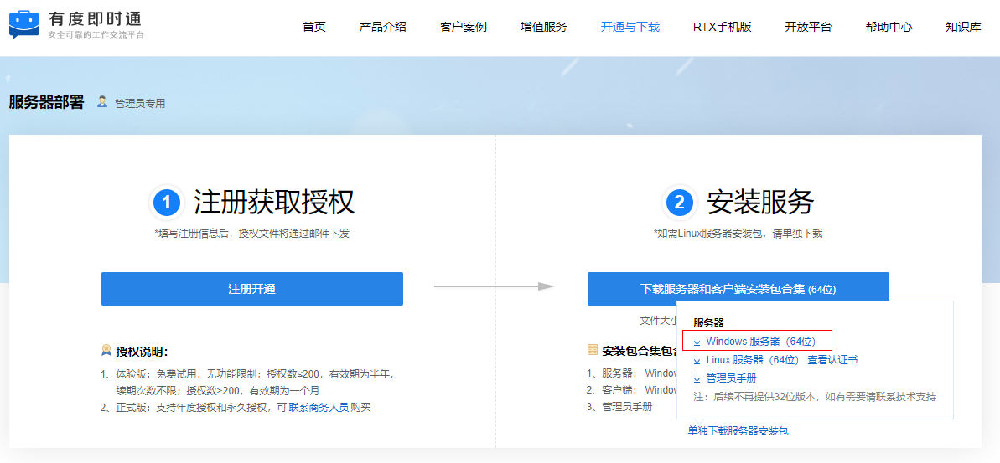
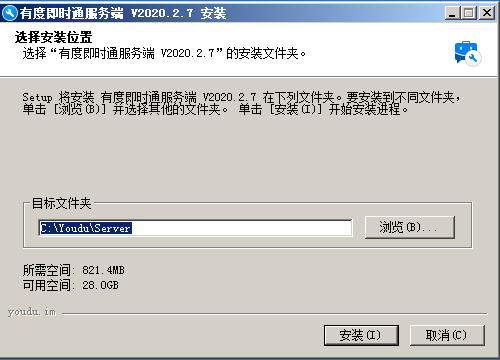
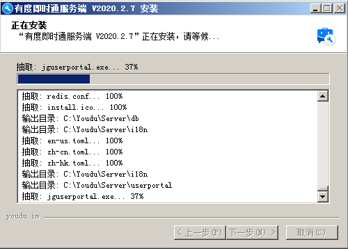
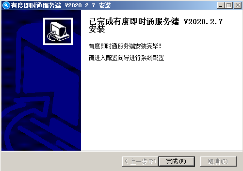
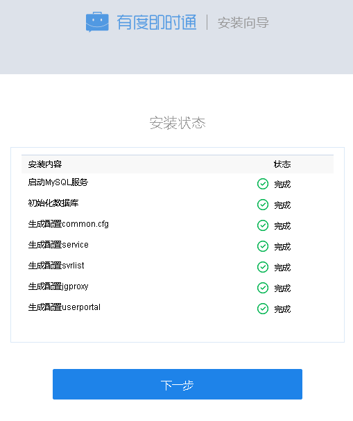

## 下载

服务器安装包下载地址：[https://youdu.im/download.html](https://youdu.im/download.html)

## 安装

​	右键安装包，点击”以管理员身份运行“。

> 注意：
>
> 1.此处只做演示，默认有D盘的情况下，会安装到D盘，建议您根据实际情况选择；
>
> 2.路径不支持中文，否则服务无法启动；

## 访问管理后台

​	地址：http://localhost:7080/userportal

> 提示：
>
> 1.请使用Chrome，火狐等浏览器访问，国产浏览器请切换到极速模式访问。
>
> 2.如果无法访问，请您确认服务器相关的防火墙策略是否已经开放，请参考：[防火墙策略](a01_00004.md)

