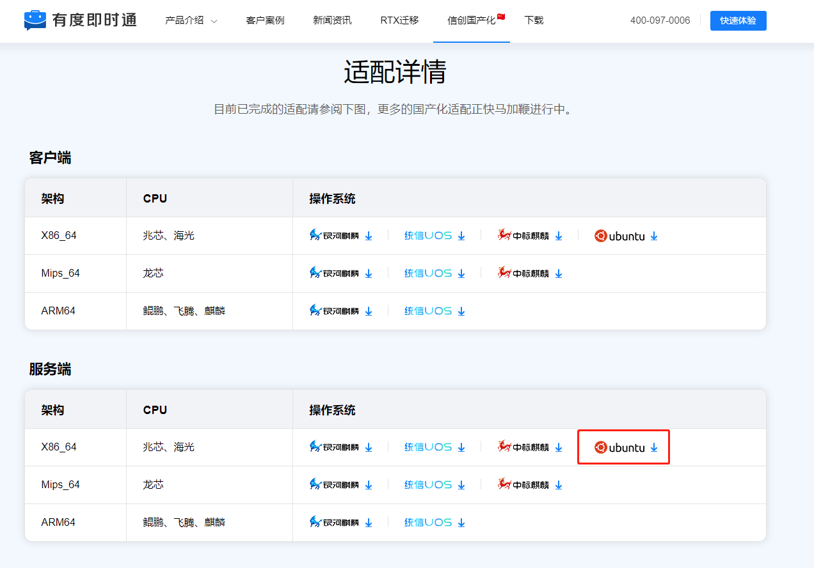

# Linux（二进制）

## 1. 说明

1. 版本自2021.1起，推荐使用[docker版](a01_00021.md)，如有疑问请联系我们；
2. 本文以CentOS 7作为示例环境，其它发行版系统在安装时如果遇到问题，请先尝试自助解决或提交工单；

## 2. 安装MySQL Server

### 2.1 设置yum源

```
cat <<eof|tee /etc/yum.repos.d/mysql-community.repo
[mysql57-community]
name=MySQL 5.7 Community Server
baseurl=http://repo.mysql.com/yum/mysql-5.7-community/el/7/x86_64/
enabled=1
gpgcheck=1
gpgkey=https://repo.mysql.com/RPM-GPG-KEY-mysql
eof
```

### 2.2 安装

```
yum -y install mysql-server mysql
```

### 2.3 调整参数

```
cat <<eof|tee -a /etc/my.cnf
innodb_buffer_pool_size = 256M
max_connections = 500
max_connect_errors = 1000
group_concat_max_len = 204800
eof
```

> 提示：
>
> innodb_buffer_pool_size可以调整为您服务器内存的一半大小，例如4GB内存，可以设置为2048M。

### 2.4 初始化

```
mysqld --initialize-insecure --user=mysql
```

### 2.5 启动

```
systemctl start mysqld
```

### 2.6 设置密码

```
mysqladmin -uroot password 'Youdu123!!'
```

##　3. 下载

​	服务器安装包下载地址：[https://youdu.im/xcgch/](https://youdu.im/xcgch/)



## 4. 上传

​	使用SFTP等工具上传即可。

## 5. 解压

```
tar xvf name.tar.gz
```

## 6. 进入脚本目录

```
cd package/name/bin
```

## 7. 开始安装

### 7.1 执行安装程序

> 注意：
>
> 1.“./linuxInstall”后面必须空格，然后指定您的安装路径。
>
> 2.安装路径不能包含安装包。

```
./linuxInstall /opt/youdu
```

### 7.2 输入MySQL用户名


```
root
```

### 7.3 输入MySQL密码


```
Youdu123!!
```

### 7.4 输入MySQL服务地址、端口


```
localhost:3306
```

### 7.5 设置管理后台语言


​	直接回车，或者输入序号后回车。

### 7.6 安装完成


## 8. 访问管理后台

​	地址：http://SERVER_IP:7080/userportal/

> 提示：
>
> 1.请使用Chrome，火狐等浏览器访问，国产浏览器请切换到极速模式访问。
>
> 2.如果无法访问，请您确认服务器相关的防火墙策略是否已经开放，请参考：[防火墙策略](a01_00004.md)

