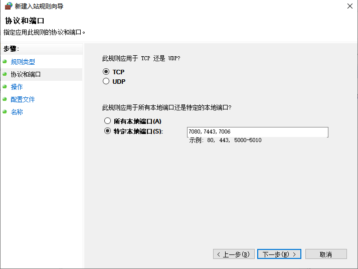

## 开放列表

| 源地址          | 目标地址                  | 端口           | 方向 | 说明                                                         |
| --------------- | ------------------------- | -------------- | ---- | ------------------------------------------------------------ |
| 0.0.0.0         | youdu_server_IP           | 7006,7080,7443 | 入站 | 客户端访问服务器。必须全部开放，缺一不可。                   |
| rtx_server_IP   | youdu_server_IP           | 7014           | 入站 | RTX服务器访问有度服务器。RTX与有度并行时才需要开放，独立使用有度、非RTX用户无需开放。 |
| youdu_server_IP | youdu.im                  | 80、443        | 出站 | [点击查看](admin/admin_faq/admin_faq?id=有度企业版（本地部署版）需要访问有度官网youduim的作用是什么) |
| youdu_server_IP | ver.youdu.im              | 443            | 出站 | 管理后台获取PC端新版本                                       |
| youdu_server_IP | api.youdu.im              | 80、443        | 出站 | 苹果手机，使用有度APP时的消息推送通道。                      |
| youdu_server_IP | api.push.hicloud.com      | 443            | 出站 | 华为推送通道（接口）                                         |
| youdu_server_IP | login.vmall.com           | 443            | 出站 | 华为推送通道（验证）                                         |
| youdu_server_IP | api.push.hicloud.com      | 443            | 出站 | 小米推送通道                                                 |
| youdu_server_IP | server-api-push.meizu.com | 80             | 出站 | 魅族推送通道                                                 |
| youdu_server_IP | gateway.push.apple.com    | 2195           | 出站 | 苹果手机，使用定制版APP时的苹果推送通道                      |
| youdu_server_IP | feedback.push.apple.com   | 2196           | 出站 | 苹果手机，使用定制版APP时的苹果推送通道（反馈）              |

​	以上端口均为TCP协议。请您根据实际需求和网络环境进行开放，如有疑问可以提交工单。

## Windows 防火墙开放端口指引

1.打开控制面板——Windows防火墙，单击左侧的“高级设置”。


2.选中入站规则，右键单击“新建规则”。

3.单击“端口”，下一步。

4.输入7006,7080,7443。此处注意逗号为半角“,”



5.继续下一步。

6.输入规则名称，完成即可。

## Linux防火墙开放端口指引

### Firewall

```
firewall-cmd --zone=public --add-port={7006,7080,7443}/tcp --permanent && firewall-cmd --reload && firewall-cmd --zone=public --list-ports
```

### Iptables

```
iptables -I INPUT -p tcp -m multiport --dports 7006,7080,7443 -j ACCEPT && service iptables save && service iptables restart
```

