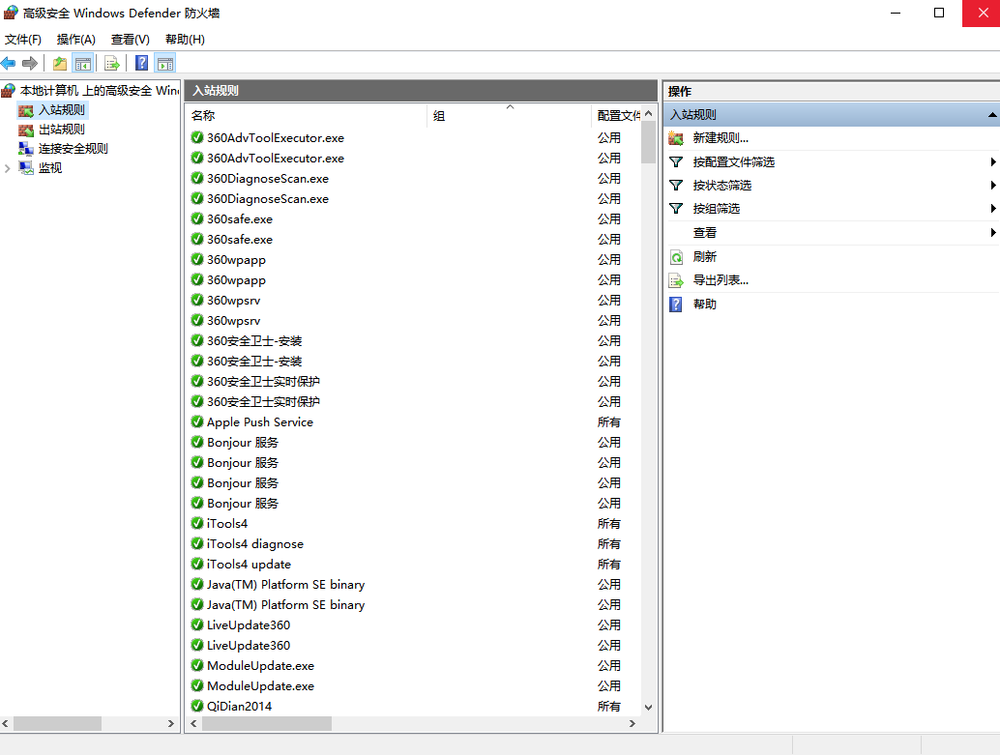
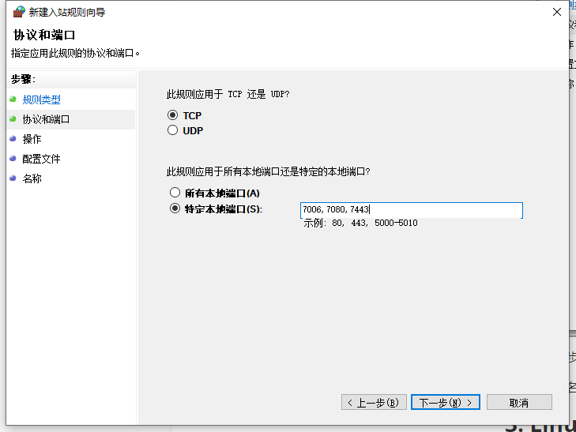
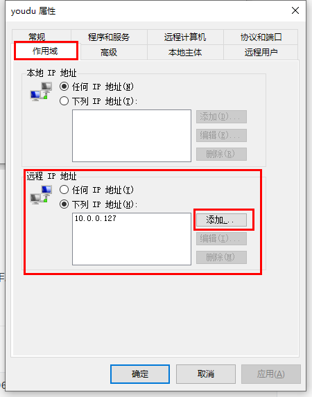

## 1. 开放列表

| 源地址          | 目标地址                  | 端口（TCP协议） | 方向 | 说明                                                         |
| --------------- | ------------------------- | --------------- | ---- | ------------------------------------------------------------ |
| 0.0.0.0         | youdu_server_IP           | 7006,7080,7443  | 入站 | 有度客户端访问服务器。**必须全部开放，缺一不可。**           |
| admin_IP        | youdu_server_IP           | 7003            | 入站 | 管理员访问管理后台。无需对终端用户开放，外网一般也不必开放，最好只允许管理员电脑访问。<br>**自2023.2.1起，管理后台端口修改为7003。2023.1.5及以前版本的后台端口仍然为7080。管理后台更换端口不影响客户端使用。** |
| 0.0.0.0         | youdu_server_IP           | 7042            | 入站 | 有度PC端远程协助。                                           |
| rtx_server_IP   | youdu_server_IP           | 7014            | 入站 | 腾讯通RTX服务器访问有度服务器。RTX与有度并行时才需要开放，**独立使用有度、非RTX用户无需开放。** |
| youdu_server_IP | youdu.im                  | 80、443         | 出站 | 有度官网                                                     |
| youdu_server_IP | ver.youdu.im              | 443             | 出站 | 管理后台检测有度PC客户端新版本。                             |
| youdu_server_IP | api.youdu.im              | 80、443         | 出站 | 苹果手机，使用有度标准APP时的消息推送通道。                  |
| youdu_server_IP | api.push.hicloud.com      | 443             | 出站 | 华为推送通道（接口）                                         |
| youdu_server_IP | login.cloud.huawei.com    | 443             | 出站 | 华为推送通道（验证）                                         |
| youdu_server_IP | api.xmpush.xiaomi.com     | 443             | 出站 | 小米推送通道                                                 |
| youdu_server_IP | server-api-push.meizu.com | 80              | 出站 | 魅族推送通道                                                 |
| youdu_server_IP | gateway.push.apple.com    | 2195            | 出站 | 苹果手机，使用有度定制版APP时的苹果推送通道                  |
| youdu_server_IP | feedback.push.apple.com   | 2196            | 出站 | 苹果手机，使用有度定制版APP时的苹果推送通道（反馈）          |

## 2. Windows 防火墙开放端口示例

### 2.1 对客户端开放登录端口

1.打开控制面板——Windows防火墙，单击左侧的“高级设置”。



2.选中入站规则，右键单击“新建规则”。

3.单击“端口”，下一步。

4.输入7006,7080,7443。

> 注意：逗号为半角“,”。



5.继续下一步。

6.输入规则名称，youdu，完成即可。

### 2.2 对管理员开放后台端口

前面的步骤和2.1一样，端口7003，然后右键规则，点击属性，点击作用域，选择远程IP地址，添加管理员电脑IP，最后应用并确定即可。



## 3. Linux防火墙开放端口指引

### 3.1 firewalld

```
#对客户端开放登录端口
firewall-cmd --zone=public --add-port={7006,7080,7443}/tcp --permanent

#对管理员开放后台端口
firewall-cmd --permanent --add-rich-rule="rule family="ipv4" source address="admin_IP" port protocol="tcp" port="7003" accept"

#重新加载生效
firewall-cmd --reload
firewall-cmd --list-ports
```

### 3.2 iptables

```
#对客户端开放登录端口
iptables -I INPUT -p tcp -m multiport --dports 7006,7080,7443 -j ACCEPT

#对管理员开放后台端口
iptables -I INPUT -p tcp -m tcp --dport 7003 -m state --state NEW -j ACCEPT

#重新加载生效
service iptables save
service iptables restart
```

