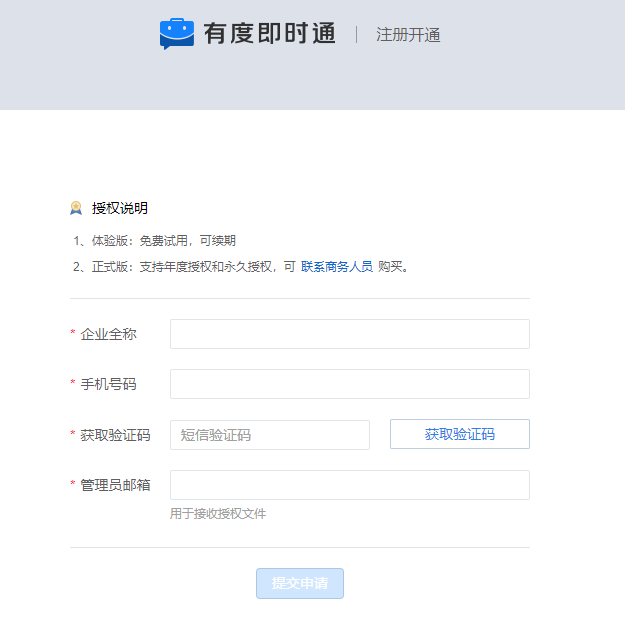

## 1. 说明

​	如果您在申请授权时遇到任何疑问或问题，请联系我们,我们会第一时间为您解决。

>商务咨询QQ：2850184511
>商务电话：18600753277  咨询热线：400-097-0006

## 2. 申请授权

​	授权申请地址：[https://youdu.im/license](https://youdu.im/license)

​	注册完成后，授权会自动下发到您的邮箱，收到邮件后，点击附件下载。

## 3. 下载授权

​	登录您申请授权时的邮箱，查看新邮件。如果没有看到新邮件，可能在回收站。**打开邮件，点击附件下载即可**。

## 4. 登录管理后台

​	地址：http://SERVER_IP:7080/userportal

​	如果是服务器本机访问，可以直接访问http://localhost:7080/userportal

> 提示：
>
> 1.请使用Chrome，火狐等浏览器访问，国产浏览器请切换到极速模式访问。
>
> 2.如果无法访问，请您确认服务器相关的防火墙策略是否已经开放，请参考：[防火墙策略](a01_00004.md)。

## 5. 导入授权

1.点击“前往导入”

2.上传License文件

3.点击“保存“即可

4.授权导入完成

