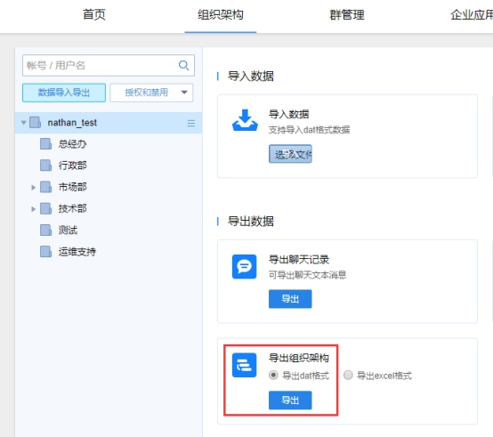
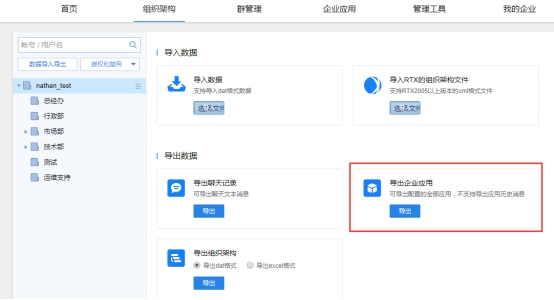
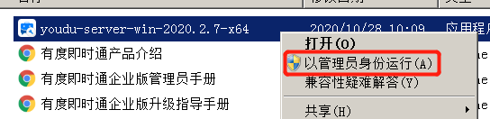
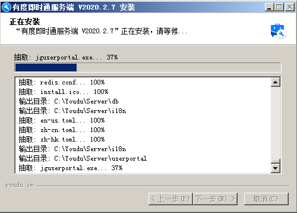
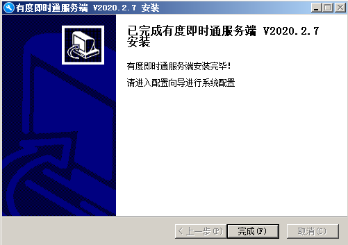

## 1. 导出通讯录

登录管理后台：http://SERVER_IP:7080/userportal/login.html

路径：组织架构-数据导入导出-导出组织架构-导出dat格式。

## 2. 导出企业应用

> 较低版本的服务端可能不支持此功能，如需备份企业应用可联系我们协助。

　　路径：组织架构-数据导入导出-导出企业应用。

## 3. 下载安装包

​		下载地址：https://youdu.im/download.html

## 4. 开始安装升级

## 5. 检查工作

> 服务升级完成后，后台服务可能在启动中，可以稍等一段时间后再进行检查工作。

###  5.1 查看在线成员情况

1. 登录管理后台。
2. 点击“管理工具”，”使用分析“，”当前在线“。
3. 在线成员符合正常情况即可。

### 5.2 测试客户端功能

1. 退出客户端，测试登录，登录过程正常即可。

2. 任意打开会话，发送文字消息，消息记录有同步显示，说明消息功能正常。

3. 任意打开会话，发送图片或文件，消息记录有同步显示，说明文件功能正常。

4. 任意打开应用，如工作汇报、网盘，可以正常打开、使用，说明应用功能正常。

   如果发现升级后服务端或客户端存在异常，请提交工单。

