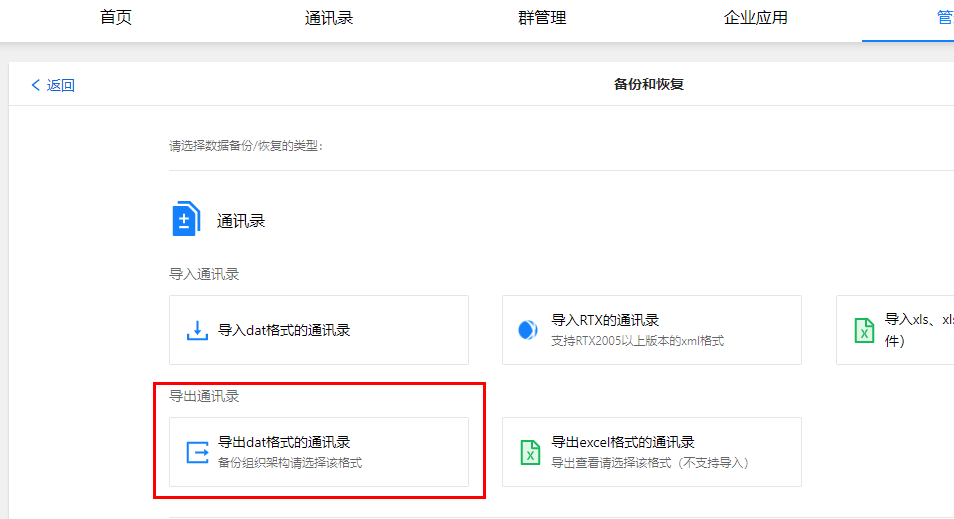
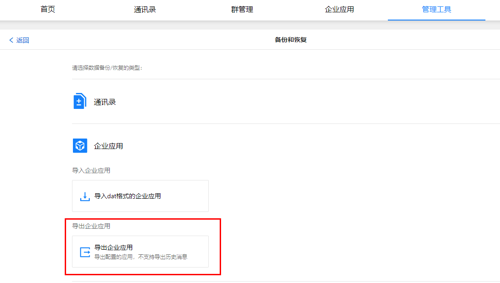
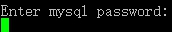
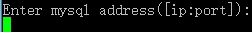
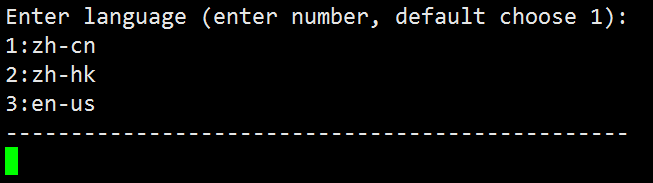

> **注意：**
>
> 版本自2021.1起，推荐使用[docker版](a01_00021.md)，如有疑问请联系我们。

## 1. 导出通讯录

​		地址：http://SERVER_IP:7003/userportal/

​		路径：管理工具-备份和恢复-通讯录-导出dat格式的通讯录。

> 注意：
>
> 如果是2023.1.5及以前的版本，**管理后台端口仍然是从7080访问**。

　



## 2. 导出企业应用

> 较低版本的服务端可能不支持此功能，如需备份企业应用可联系我们协助。

　　路径：管理工具-备份和恢复-企业应用-导出企业应用。



## 3. 下载安装包

​		下载地址：[https://youdu.im/download/](https://youdu.im/download/)

## 4. 上传

​	使用SFTP等工具上传即可。

## 5. 解压

```
tar xvf name.tar.gz
```

## 6. 进入脚本目录

```
cd package/name/bin
```

## 7. 开始安装

### 7.1 执行安装程序

> 注意：
>
> 1.“./linuxInstall”后面必须空格，然后指定您的安装路径。
>
> 2.安装路径不能包含安装包。
>
> 3.请切换到root帐号安装。

```
./linuxInstall /opt/youdu
```

### 7.2 输入MySQL用户名


```
root
```

> 请以您的实际用户名为准！

### 7.3 输入MySQL密码



```
Youdu123456
```

> 请以您的实际密码为准！

### 7.4 输入MySQL服务地址、端口



```
localhost:3306
```

> 请以您的实际地址、端口为准！

### 7.5 设置管理后台语言



​	直接回车，或者输入序号后回车。

### 7.6 安装完成


## 8. 检查工作

> 服务升级完成后，后台服务可能在启动中，可以稍等一段时间后再进行检查工作。

### 8.1 访问管理后台

地址：http://SERVER_IP:7003/userportal/

服务器本机访问示例：[http://localhost:7003/userportal/](http://localhost:7003/userportal/)

> 注意：
>
> 1.如果是2023.1.5及以前的版本，**管理后台端口仍然是从7080访问**；
>
> 2.请使用Chrome，火狐等浏览器访问，国产浏览器请切换到极速模式访问。
>
> 3.如果无法访问，请您确认服务器相关的防火墙策略是否已经开放，请参考：[防火墙策略](a01_00004.md)

###  8.2 查看在线成员情况

1. 登录管理后台。
2. 点击“管理工具”，”使用分析“，”当前在线“。
3. 在线成员符合正常情况即可。

### 8.3 测试客户端功能

1. 退出客户端，测试登录，登录过程正常即可。

2. 任意打开会话，发送文字消息，消息记录有同步显示，说明消息功能正常。

3. 任意打开会话，发送图片或文件，消息记录有同步显示，说明文件功能正常。

4. 任意打开应用，如工作汇报、网盘，可以正常打开、使用，说明应用功能正常。

   如果发现升级后服务端或客户端存在异常，请提交工单。


