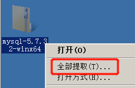
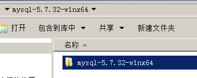
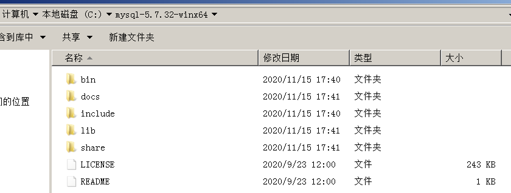
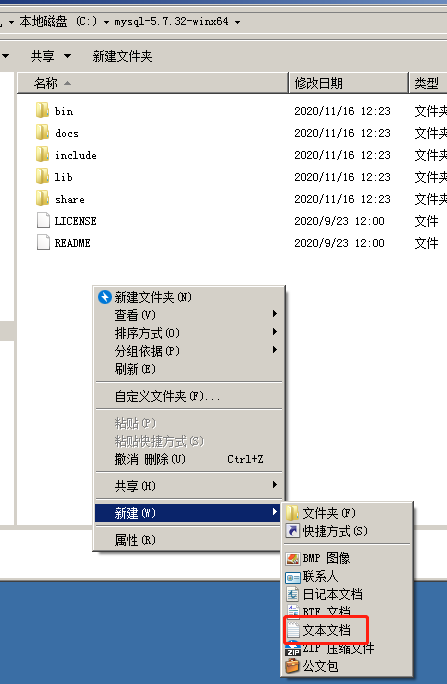
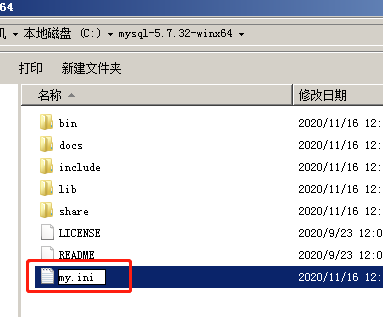
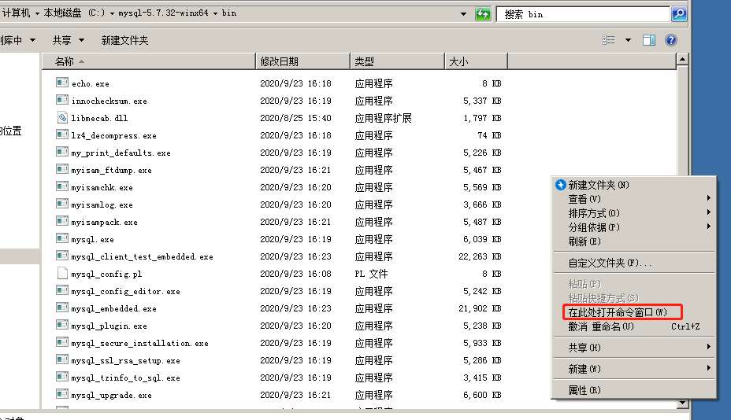
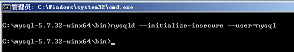

## 服务器配置建议

|      | 200人以内                        | 1000人以内                       |
| ---- | -------------------------------- | -------------------------------- |
| CPU  | 2核                              | 4核                              |
| 内存 | 4G                               | 8G                               |
| 存储 | 100GB                            | 500                              |
| 网络 | 1000Mbps                         | 1000Mbps                         |
| 系统 | Windows Server 2008 R2及更新版本 | Windows Server 2008 R2及更新版本 |

​		1000人以上请联系我们提供方案建议。

## 下载压缩包

​		下载地址：[https://dev.mysql.com/get/Downloads/MySQL-5.7/mysql-5.7.32-winx64.zip](https://dev.mysql.com/get/Downloads/MySQL-5.7/mysql-5.7.32-winx64.zip)

## 解压压缩包








## 配置文件

- 在解压根目录下，创建my.ini配置文件。

  

  

  

- 内容示例如下，请根据实际情况修改路径。

```
[mysqld]
#skip_grant_tables #密码重置，跳过权限验证

#service
port = 3306 #监听端口号，mysqld默认监听3306，建议修改成其他端口号
datadir=C:\mysql-5.7.32-winx64\data #数据存储位置
basedir=C:\mysql-5.7.32-winx64 #安装目录

#ssl
ssl-ca=cacert.pem #CA颁发证书
ssl-cert=server-cert.pem #公钥
ssl-key=server-key.pem #私钥
#require_secure_transport=ON #强制客户端SSL访问

#log
log_error = C:\mysql-5.7.32-winx64\data\mysqld.log #错误日志存储位置
slow_query_log = on #开启慢查询日志
slow_launch_time = 10 #慢查询阈值
slow_query_log_file = C:\mysql-5.7.32-winx64\data\mysql-slow.log #慢查询日志存储位置

#optimization
group_concat_max_len = 204800 #允许的最大长度
max_connections = 500 #允许最大连接数
max_connect_errors = 1000 #允许最多链接错误次数
innodb_buffer_pool_size = 256M #引擎缓存大小
innodb_file_per_table = 1 #表空间独立存储

#binlog
server-id=1 #每个server的ID均不一样，主服务器用1，其它服务器顺延使用
log-bin=mysql-bin #binlog文件名称，可自定义
expire_logs_days = 7 #binlog有效期（天）
```

>innodb_buffer_pool_size可以调整为您服务器内存的一半大小，例如4GB内存，可以设置为2048M。

## 安装MySQL

1.进入bin目录，按住shift键，同时右键空白区域，点击“在此处打开命令窗口”。



2.初始化MySQL

```
mysqld --initialize-insecure --user=mysql
```



> 如果这一步失败，可能是DLL文件缺失，请安装vc2015后，再重新尝试。
>
> 下载地址：[https://download.microsoft.com/download/9/3/F/93FCF1E7-E6A4-478B-96E7-D4B285925B00/vc_redist.x64.exe](https://download.microsoft.com/download/9/3/F/93FCF1E7-E6A4-478B-96E7-D4B285925B00/vc_redist.x64.exe)

3.注册服务

```
mysqld install
```

4.启动服务

```
net start mysql
```

5.设置密码

```
mysqladmin -uroot password Youdu123!!
```

## 设置远程访问

​		默认mysql只能本机访问，需要授权远程访问。例如有度服务器IP是192.168.1.100，示例：

```
#登录mysql
mysql -uroot -p

#执行授权语句
grant all privileges on *.* to 'root'@'192.168.1.100' identified by 'Youdu123!!';
```

> 请根据实际情况修改IP地址，用户名、密码也可以自定义。

## 防火墙

​		请开放3306端口，一般情况下，只对有度服务器开放即可。