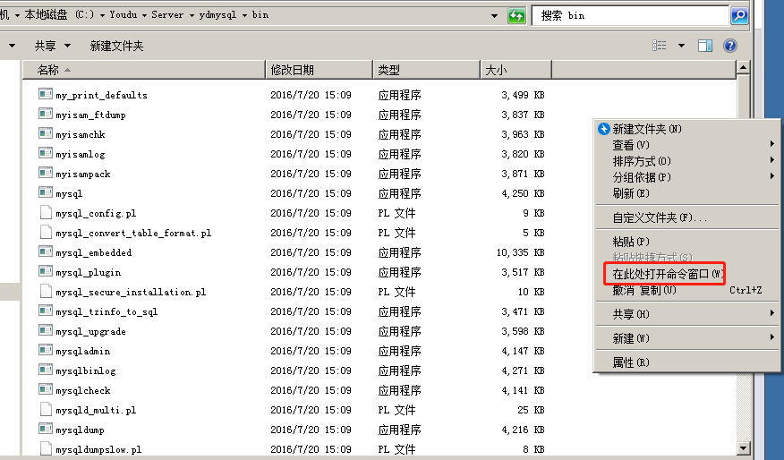
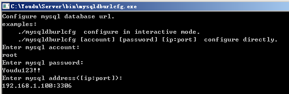

## 说明

- MySQL有效性确认：迁移前，请确认新的MySQL正常运行，确认有度服务器能远程访问MySQL。
- 备份数据：为了以防万一，迁移前可以备份一下数据。
- 有度服务停止：**迁移全程，有度服务必须完全处于停止状态**，只有MySQL迁移完成后，以及有度服务修改好访问MySQL连接，才可以启动服务。
- 如有任何疑问，请联系我们。

## 1. 停止有度服务

​		登录有度服务器，打开系统服务，找到youdu_service，右键停止服务，并修改启动类型为手动或禁用。

> 注意：
>
> 禁用的目的是避免服务启动，**迁移全程，有度服务必须完全处于停止状态，否则会引发严重故障。**

## 2. 导出数据

登录有度服务器，导出旧mysql的数据。

（1）进入mysql的bin目录，例如C:\Youdu\Server\ydmysql\bin

（2）按住shift键，同时右键空白区域，点击“在此处打开命令窗口”。



（3）执行导出数据命令，例如：

自带mysql的默认密码是root。

```
mysqldump -uroot -p -A > D:\youdu_all.sql
```

（4）上一步执行完毕后，数据存储在D:\youdu_all.sql。

（5）拷贝D:\youdu_all.sql到数据库服务器。

## 3. 导入数据

登录新的mysql服务器，导入数据。

（1）进入mysql的bin目录，例如C:\mysql-5.7.32-winx64\bin

（2）按住shift键，同时右键空白区域，点击“在此处打开命令窗口”。


（3）执行命令即可。

```
mysql -uroot -p < youdu_all.sql
```

## 4. 有度服务器重新配置连接到新的mysql

（1）进入C:\Youdu\Server\bin

按住shift键，同时右键空白区域，点击“在此处打开命令窗口”。

（2）执行命令

```
dburlcfg mysql
```

> 如果没有dburlcfg，请联系我们获取。
>

（3）依次根据提示输入数据库的用户名、密码、地址、端口。示例：

```
root
Youdu123!!
192.168.1.100:3306
```

> 注意：
>
> 请务必以您数据库的实际信息为准。




## 5. 启动有度服务

​		打开系统服务，将youdu_service启动即可。

## 6. 测试客户端功能

1. 退出客户端，测试登录，登录过程正常即可。

2. 任意打开会话，发送文字消息，消息记录有同步显示，说明消息功能正常。

3. 任意打开会话，发送图片或文件，消息记录有同步显示，说明文件功能正常。

4. 任意打开应用，如工作汇报、网盘，可以正常打开、使用，说明应用功能正常。

   如果发现迁移数据库后存在异常，请联系我们。

