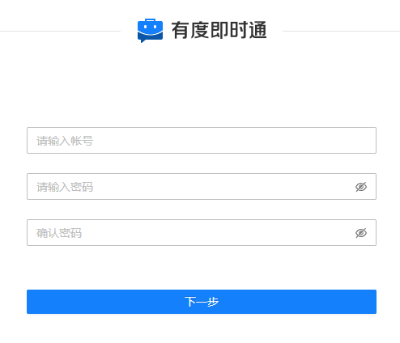

> 安装过程如遇任何问题，请提交工单或联系商务经理、技术支持获得帮助。

## 1.安装前的准备

您需要先安装docker，才能继续后面的步骤，[点击查看docker安装文档](a01_00021.md)。

## 2.如何离线安装

​		如果您的服务器无法访问互联网，可以联系我们获取镜像文件，上传到服务器导入镜像文件，后续的步骤一样。

​		导入镜像的方法请看：[导入镜像](a01_00022.md#12)

## 3. 镜像介绍

- 发布地址：[https://hub.docker.com/r/xindaim/youdu](https://hub.docker.com/r/xindaim/youdu)

- 镜像列表

> 产品持续更新，请根据Docker hub的发布历史，选用最新的版本（tag）。

| 镜像名称            | 说明               |
| ------------------- | ------------------ |
| xindaim/youdu       | 有度服务端镜像。   |
| mysql               | MySQL Server镜像。 |
| portainer/portainer | Portainer镜像。    |

## 4. 创建网桥

```
docker network create youdu
```

## 5. MySQL

```
docker run --name mysql -itd \
--network youdu \
-v /opt/mysql/data:/var/lib/mysql \
-v /opt/mysql/config:/etc/mysql \
-p 3306:3306 \
-e MYSQL_ROOT_PASSWORD=Youdu123456 \
--restart=always mysql:5.7
```

## 6. 优化MySQL配置

```
cat <<eof|sudo tee /opt/mysql/config/my.cnf
[mysqld]
#log
slow_query_log = on #开启慢查询日志
slow_launch_time = 1 #慢查询阈值
slow_query_log_file = mysql-slow.log #慢查询日志存储位置
log_timestamps = SYSTEM #日志时间的时区

#optimization
group_concat_max_len = 204800 #允许的最大长度
max_connections = 500 #允许最大连接数
max_connect_errors = 1000 #允许最多链接错误次数
innodb_buffer_pool_size = 1024M #引擎缓存大小
innodb_file_per_table = 1 #表空间独立存储
max_allowed_packet = 1024M #允许的最大数据包大小
eof

#重启mysql容器生效
docker restart mysql
```

> 提示：
>
> innodb_buffer_pool_size可以调整为您服务器内存的一半大小，例如4GB内存，可以设置为2048M。

## 7. 有度服务端

```
docker run --name youdu -itd \
--network youdu \
-v /opt/youdu/backup:/youdu/backup \
-v /opt/youdu/config:/youdu/config \
-v /opt/youdu/db:/youdu/db \
-v /opt/youdu/log:/youdu/log \
-v /opt/youdu/userportal/conf:/youdu/userportal/conf \
-v /opt/youdu/userportal/log:/youdu/userportal/log \
-v /opt/youdu/jgview/conf:/youdu/jgview/conf \
-v /opt/youdu/jgview/log:/youdu/jgview/log \
-v /opt/youdu/apps/clockapp/conf:/youdu/apps/clockapp/conf \
-v /opt/youdu/apps/clockapp/log:/youdu/apps/clockapp/log \
-v /opt/youdu/ydform/conf:/youdu/ydform/conf \
-v /opt/youdu/ydform/log:/youdu/ydform/log \
-v /opt/youdu/pkg:/youdu/pkg \
-p 7006:7006/tcp -p 7080:7080/tcp -p 7443:7443/tcp -p 7042:7042/tcp \
-e MYSQL_ADDR=mysql:3306  -e MYSQL_USER=root -e MYSQL_PWD=Youdu123456 \
--restart=always xindaim/youdu
```

​		大约2分钟左右，服务初始化启动完成，部署成功。

## 8. 访问管理后台

​	地址：http://SERVER_IP:7080/userportal/

> 提示：
>
> 1.请使用Chrome，火狐等浏览器访问，国产浏览器请切换到极速模式访问。
>
> 2.如果无法访问，请您确认服务器相关的防火墙策略是否已经开放，请参考：[防火墙策略](a01_00004.md)



## 9. Portainer

> 安装Portainer容器管理平台，以后可以直接通过web界面对有度服务端做维护、升级，简单便捷。

```
docker volume create portainer_data
docker run -d -p 8000:8000 -p 9000:9000 --name=portainer --restart=always -v /var/run/docker.sock:/var/run/docker.sock -v portainer_data:/data portainer/portainer-ce
```

​		地址：http://SERVER_IP:9000

​		使用介绍请看：[Portainer使用手册](a01_00024.md)