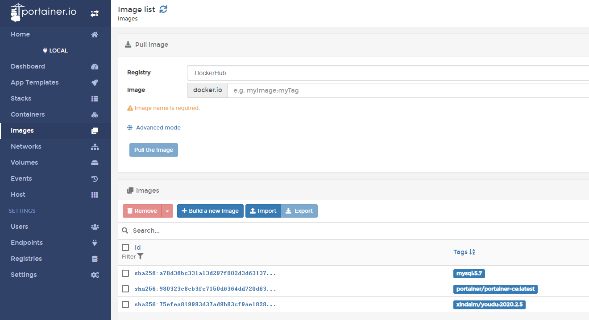

# Portainer使用手册

> 更多信息请查阅Portainer官方文档：https://documentation.portainer.io

## 1. 安装

```
docker volume create portainer_data
docker run -d -p 8000:8000 -p 9000:9000 --name=portainer --restart=always -v /var/run/docker.sock:/var/run/docker.sock -v portainer_data:/data portainer/portainer-ce
```

## 2. 登录后台

浏览器打开：http://portainer_IP:9000

ps：建议使用谷歌、火狐等浏览器打开。

## 3. 设置管理员


## 4. 选择portainer连接的容器平台


## 5. 进入容器节点


## 6. 界面说明


- containers：容器
- images：镜像
- networks：网络
- volumes：逻辑卷（存储）

## 7. 容器


- start：启动
- stop：停止
- kill：强制停止
- restart：重启
- pause：暂停
- resume：从暂停状态恢复
- remove：删除
- add container：添加容器

## 8. 查看单个容器


## 9. 镜像


## 10. 在线升级有度示例

> 升级前请备份数据，登录管理后台备份通讯录、企业应用。

- 进入容器


- 点击“Duplicate/Edit”


- 修改镜像版本


- 点击部署“Deploy the container”


> 这个提示是指portainer会把这个容器删除重建，询问是否更新，允许即可（数据目录已经映射到宿主机，此时容器删除不会丢失重要数据）。


## 11. 离线升级有度示例

> 升级前请备份数据，登录管理后台备份通讯录、企业应用。

- 可以通过一个能上外网的docker系统获取镜像，然后导出。或者联系有度商务经理、技术支持获取镜像文件。
- 点击镜像



- 点击"import"-"select file"，选中要上传的镜像文件


- 导入镜像文件完成


- 进入容器


- 点击“Duplicate/Edit”


- 修改镜像版本


- 点击部署“Deploy the container”


> 这个提示是指portainer会把这个容器删除重建，询问是否更新，允许即可（数据目录已经映射到宿主机，此时容器删除不会丢失重要数据）。

