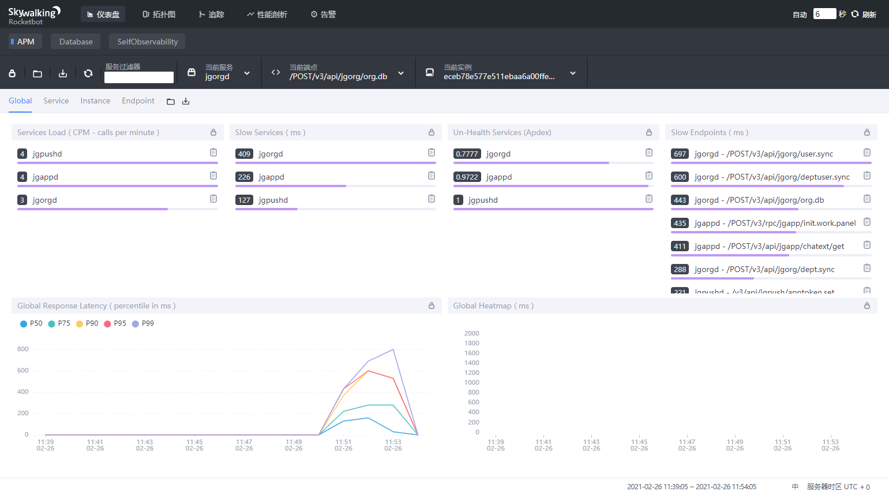

# APM系统部署

## 1. 介绍

- 什么是APM？

APM系统是一个可以帮助IT人员理解系统行为、用于分析性能问题的工具，以便发生异常的时候，能够快速定位和解决问题，这就是APM系统，全称是(Application Performance Monitor)。

- 为什么引入APM系统，有什么应用场景？

有度服务端作为私有化本地部署软件，不同的企业、单位的服务运行环境不同，配置也有很大的差别。通过引入APM系统，可以记录有度服务端的使用情况，分析性能，这有助于我们帮助管理员提升有度服务端的运行速度和稳定性。

例如：某企业发现大量用户会话消息收发比较慢，我们通过APM进行分析定位，快速发现问题的异常点，迅速安排工程师修复问题，解决问题的成本、效率大幅降低、提升。

- 有度的APM系统基于什么平台？

通过调研分析，我们引用SkyWalking作为有度服务端的APM系统。

- 为什么选择SkyWalking？

SkyWalking 是一个基于 OpenTracing 规范的、开源的 APM 系统，它是专门为微服务架构以及云原生架构而设计的。

## 2. 部署准备

### 2.1 服务器配置建议

APM会占用一定的系统资源，建议单独一个服务器部署，不要与有度服务端一起运行。

| 配置项 | 规格                                                         |
| ------ | ------------------------------------------------------------ |
| 系统   | 支持安装Docker的Linux系统，例如CentOS 7.6，Ubuntu18.04 LTS以上版本。 |
| CPU    | 4核以上                                                      |
| 内存   | 8GB以上                                                      |
| 硬盘   | 100GB以上                                                    |
| 网络   | 1000Mbps以上                                                 |

### 2.2 安装Docker

SkyWalking提供了docker镜像，通过docker可以快速部署使用。如果还没有安装Docker，请参考：[Docker环境准备](a01_00021.md)。

### 2.3 安装docker-compose

```
sudo curl -L "https://github.com/docker/compose/releases/download/1.28.4/docker-compose-$(uname -s)-$(uname -m)" -o /usr/bin/docker-compose
sudo chmod +x /usr/bin/docker-compose
```

## 3. 导入镜像

服务器如果是离线网络无法访问互联网，请联系有度技术支持提供镜像文件。

允许联网的服务器可以跳过此步骤。

| 镜像名称                        | 说明            |
| ------------------------------- | --------------- |
| elasticsearch:6.8.6             | 日志处理系统    |
| skywalking-oap-server:8.1.0-es6 | APM监控分析系统 |
| skywalking-ui:8.1.0             | WEB前端展示     |

## 4. 编排配置文件

```
cat <<eof|tee ./docker-compose.yml
# Licensed to the Apache Software Foundation (ASF) under one
# or more contributor license agreements.  See the NOTICE file
# distributed with this work for additional information
# regarding copyright ownership.  The ASF licenses this file
# to you under the Apache License, Version 2.0 (the
# "License"); you may not use this file except in compliance
# with the License.  You may obtain a copy of the License at
#
#     http://www.apache.org/licenses/LICENSE-2.0
#
# Unless required by applicable law or agreed to in writing, software
# distributed under the License is distributed on an "AS IS" BASIS,
# WITHOUT WARRANTIES OR CONDITIONS OF ANY KIND, either express or implied.
# See the License for the specific language governing permissions and
# limitations under the License.

version: '3.8'
services:
  elasticsearch:
    image: docker.elastic.co/elasticsearch/elasticsearch:6.8.6
    container_name: elasticsearch
    restart: always
    ports:
      - 9200:9200
    healthcheck:
      test: ["CMD-SHELL", "curl --silent --fail localhost:9200/_cluster/health || exit 1"]
      interval: 30s
      timeout: 10s
      retries: 3
      start_period: 40s
    environment:
      - discovery.type=single-node
      - bootstrap.memory_lock=true
      - "ES_JAVA_OPTS=-Xms4096m -Xmx4096m"
      - thread_pool.write.queue_size=1000
      - thread_pool.index.queue_size=1000
    ulimits:
      memlock:
        soft: -1
        hard: -1
    volumes:
      - data:/usr/share/elasticsearch/data
  oap:
    image: apache/skywalking-oap-server:8.1.0-es6
    container_name: oap
    depends_on:
      - elasticsearch
    links:
      - elasticsearch
    restart: always
    ports:
      - 11800:11800
      - 12800:12800
    healthcheck:
      test: ["CMD-SHELL", "/skywalking/bin/swctl"]
      interval: 30s
      timeout: 10s
      retries: 3
      start_period: 40s
    environment:
      SW_STORAGE: elasticsearch
      SW_STORAGE_ES_CLUSTER_NODES: elasticsearch:9200
      JAVA_OPTS: "-Xms2048m -Xmx2048m" 
  ui:
    image: apache/skywalking-ui:8.1.0
    container_name: ui
    depends_on:
      - oap
    links:
      - oap
    restart: always
    ports:
      - 8080:8080
    environment:
      SW_OAP_ADDRESS: oap:12800

volumes:
  data:
    driver: local
eof
```

## 5. 启动容器

```
docker-compose up -d
```

## 6. 开放端口

```
firewall-cmd --zone=public --add-port={8080,11800}/tcp --permanent \
&& firewall-cmd --reload \
&& firewall-cmd --zone=public --list-ports
```

## 7. 修改有度服务端配置文件

打开配置文件common.cfg.ini，修改以下项：

- apmAddr：改为apm服务器的地址，端口不变。

- logFileNum：reportType为1时本地的日志保存个数。

- reportType：改为2。

  0表示关闭apm功能；

  1表示开启apm功能，但是不推送日志至apm系统；

  2表示开启apm功能并推送日志至apm系统。

重启有度服务即可生效。

## 8. 登录APM后台

地址：http://APM_IP:8080

> 如果没有结果显示，可以尝试点击右上角的刷新按钮



## 9. 使用说明

如果有性能分析的需求，请联系技术支持协助。文档后续发布更新，敬请关注。