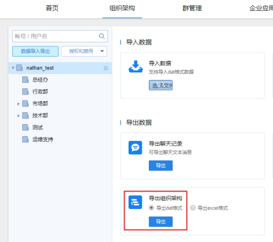
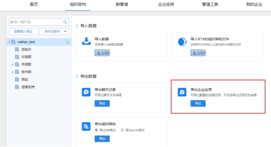

## 1. 备份重要数据

### 1.1 导出通讯录

​	登录管理后台：http://SERVER_IP:7080/userportal/login.html

　　路径：组织架构-数据导入导出-导出组织架构-导出dat格式。



### 1.2 导出企业应用

> 较低版本的服务端可能不支持此功能，如需备份企业应用可联系我们协助。

　　路径：组织架构-数据导入导出-导出企业应用。



## 2.图形界面升级

请通过Portainer进行升级：[点击跳转](a01_00024.md#10)

## 3.命令行升级

### 3.1 更新镜像

- 如果是在线环境，直接拉取最新镜像：

```
docker pull xindaim/youdu:2021.1.19
```

**2021.1.19就是tag，也是版本号。此处只是示例，在官网下载页面或Docker hub（[https://hub.docker.com/r/xindaim/youdu/tags](https://hub.docker.com/r/xindaim/youdu/tags)）获取最新的tag。**

- 如果是离线环境，即内网无法访问互联网的场景，可以联系有度技术支持或商务获取镜像文件，导入镜像：

```
docker image load -i name.tar
```

### 3.2 重建容器

```
docker stop youdu
docker rm youdu
docker run --name youdu -itd \
--network youdu \
-v /opt/youdu/backup:/youdu/backup \
-v /opt/youdu/config:/youdu/config \
-v /opt/youdu/db:/youdu/db \
-v /opt/youdu/log:/youdu/log \
-v /opt/youdu/userportal/conf:/youdu/userportal/conf \
-v /opt/youdu/jgview/conf:/youdu/jgview/conf \
-v /opt/youdu/apps/clockapp/conf:/youdu/apps/clockapp/conf \
-v /opt/youdu/pkg:/youdu/pkg \
-p 7006:7006/tcp -p 7080:7080/tcp -p 7443:7443/tcp \
-e MYSQL_ADDR=mysql:3306  -e MYSQL_USER=root -e MYSQL_PWD=Youdu123456 \
--restart=always xindaim/youdu:2021.1.19
```

> 注意：请以您的实际参数为准，包括不限于网桥、路径、mysql地址、mysql用户名、mysql密码、tag（默认用最新）。

### 3.3 升级完成

通过命令查看容器日志。

```
docker logs -f youdu
```

## 4. 检查工作

> 服务升级完成后，后台服务可能在启动中，可以稍等一段时间后再进行检查工作。

#### 4.1 查看在线成员情况

1. 登录管理后台。
2. 点击“管理工具”，”使用分析“，”当前在线“。
3. 在线成员符合正常情况即可。

#### 4.2 测试客户端功能

1. 退出客户端，测试登录，登录过程正常即可。
2. 任意打开会话，发送文字消息，消息记录有同步显示，说明消息功能正常。
3. 任意打开会话，发送图片或文件，消息记录有同步显示，说明文件功能正常。
4. 任意打开应用，如工作汇报、网盘，可以正常打开、使用，说明应用功能正常。

如果发现升级后服务端或客户端存在异常，请提交工单。