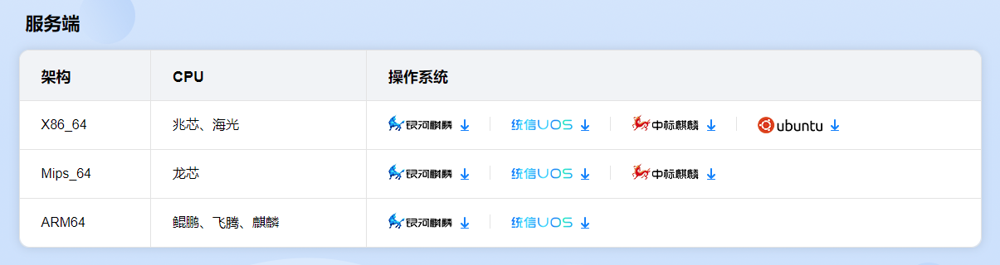
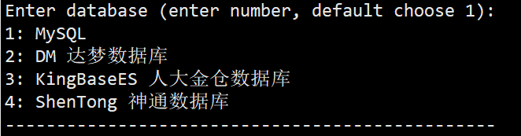
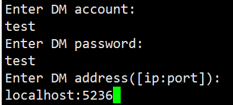
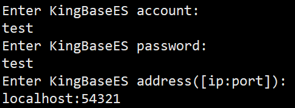
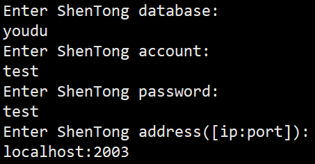
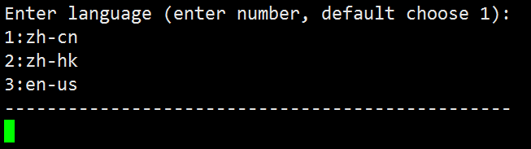
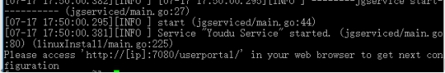
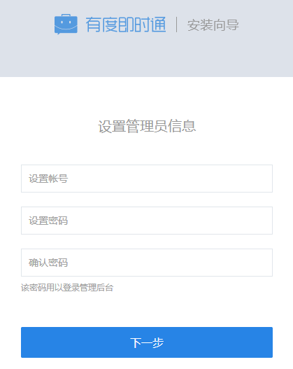

> 后续升级服务端，本文档同样适用。

## 1. 数据库环境准备

### 1.1 国产数据库说明

目前已经支持并适配的国产数据库有：

- 达梦数据库；
- 人大金仓数据库；
- 神通数据库；

更多的数据库正在适配更新中，如有疑问请联系我们。

> 提示：
>
> 如果您单位没有要求使用国产数据库，您也可以使用MySQL数据库，[点击查看MySQL安装文档](a01_00011.md)。

### 1.2 数据库连接信息

> 提示：
>
> 请您确认数据库已经准备就绪，建议您使用数据库自带的管理工具，测试一下数据库的连接可用性。

在下面的服务端安装步骤中，会使用到以下信息：

- 数据库用户名；
- 数据库密码；
- 数据库地址；
- 数据库端口；

### 1.3 关于人大金仓数据库的参数调整

> 默认人大金仓数据库会把空字符串等同于NULL，需要关闭这个特性。其它国产数据库暂时未发现该问题，无需处理。

解决方法：

修改人大金仓数据库的配置文件（人大金仓安装路径/Kingbase/ES/V8/data/kingbase.conf），调整下面的参数，调整完毕后重启人大金仓数据库即可。

```
ora_input_emptystr_isnull = off
```

## 2. 有度服务端安装

### 2.1 下载安装包

服务器安装包下载地址：[https://youdu.im/download-linux/](https://youdu.im/download-linux/)



> **注意**：
>
> 请根据服务器实际的处理器架构、操作系统，选择安装包下载，如有疑问请联系我们。

查询架构命令：

```
arch
```

### 2.2 上传安装包

使用SFTP等工具上传即可。

### 2.3 解压安装包

```
tar xvf name.tar.gz
```

### 2.4 进入安装脚本目录

```
cd package/name/bin
```

### 2.5 开始安装

#### 2.5.1 执行安装程序

> 注意：
>
> 1.“./linuxInstall”后面必须空格，然后指定您的安装路径。
>
> 2.安装路径不能包含安装包。
>
> 3.请切换到root帐号安装。

```
./linuxInstall /opt/youdu
```

#### 2.5.2 选择数据库

> 注意：
>
> 请根据实际情况选择您的数据库。



#### 2.5.3 填写数据库的连接信息

> 注意：
>
> 请根据实际情况填写数据库的连接信息，此处只做示例。

示例：

- 达梦数据库：



- 人大金仓数据库：



- 神通数据库：



#### 2.5.4 设置管理后台语言



#### 2.5.5 安装完成



### 2.6 访问管理后台

地址：http://SERVER_IP:7003/userportal/

服务器本机访问示例：[http://localhost:7003/userportal/](http://localhost:7003/userportal/)

> 注意：
>
> 1.如果是2023.1.5及以前的版本，**管理后台端口仍然是从7080访问**；
>
> 2.请使用Chrome，火狐等浏览器访问，国产浏览器请切换到极速模式访问。
>
> 3.如果无法访问，请您确认服务器相关的防火墙策略是否已经开放，请参考：[防火墙策略](a01_00004.md)



