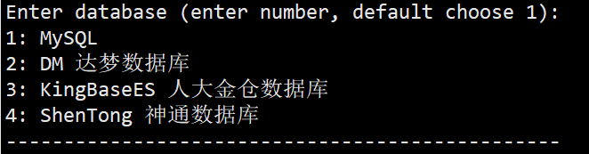
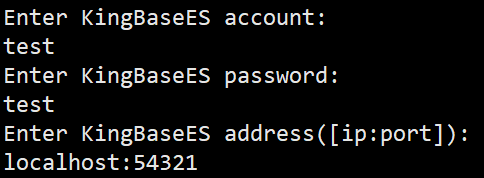

## 1. 准备数据库连接信息

>提示：这些信息在您首次部署时已经设置过，请您自行查找或联系数据库厂商协助确认。

- 数据库用户名；
- 数据库密码；
- 数据库地址；
- 数据库端口；

## 2. 有度服务端升级

### 2.1 下载安装包

服务器安装包下载地址：[https://youdu.im/download-linux/](https://youdu.im/download-linux/)


> **注意**：
>
> 请根据服务器实际的处理器架构、操作系统，选择安装包下载，如有疑问请联系我们。

查询架构命令：

```
arch
```

### 2.2 上传安装包

使用SFTP等工具上传即可。

### 2.3 解压安装包

```
tar xvf name.tar.gz
```

### 2.4 进入安装脚本目录

```
cd package/name/bin
```

### 2.5 开始安装

#### 2.5.1 执行安装程序

> 注意：
>
> 1.“./linuxInstall”后面必须空格，然后指定您的安装路径。
>
> 2.安装路径不能包含安装包。
>
> 3.请切换到root帐号安装。

```
./linuxInstall /opt/youdu
```

#### 2.5.2 选择数据库

> 注意：
>
> 请根据实际情况选择您的数据库。



#### 2.5.3 填写数据库的连接信息

> 注意：
>
> 请根据实际情况填写数据库的连接信息，此处只做示例。

示例：

- 达梦数据库：


- 人大金仓数据库：



- 神通数据库：


#### 2.5.4 设置管理后台语言


#### 2.5.5 安装完成


## 3. 检查工作

> 服务升级完成后，后台服务可能在启动中，可以稍等一段时间后再进行检查工作。

### 3.1 访问管理后台

地址：http://SERVER_IP:7003/userportal/

服务器本机访问示例：[http://localhost:7003/userportal/](http://localhost:7003/userportal/)

> 注意：
>
> 1.如果是2023.1.5及以前的版本，**管理后台端口仍然是从7080访问**；
>
> 2.请使用Chrome，火狐等浏览器访问，国产浏览器请切换到极速模式访问。
>
> 3.如果无法访问，请您确认服务器相关的防火墙策略是否已经开放，请参考：[防火墙策略](a01_00004.md)

###  3.2 查看在线成员情况

1. 登录管理后台。
2. 点击“管理工具”，”使用分析“，”当前在线“。
3. 在线成员符合正常情况即可。

### 3.3 测试客户端功能

1. 退出客户端，测试登录，登录过程正常即可。

2. 任意打开会话，发送文字消息，消息记录有同步显示，说明消息功能正常。

3. 任意打开会话，发送图片或文件，消息记录有同步显示，说明文件功能正常。

4. 任意打开应用，如工作汇报、网盘，可以正常打开、使用，说明应用功能正常。

   如果发现升级后服务端或客户端存在异常，请联系我们。

