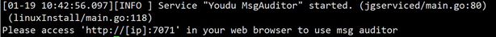

# Linux版消息审计插件安装

## 说明

​		本文以CentOS 7作为系统环境演示，其它发行版系统请自行查阅相关信息，步骤大同小异。

## 安装MongoDB

```shell
cat <<eof|tee /etc/yum.repos.d/mongodb-org-5.0.repo
[mongodb-org-5.0]
name=MongoDB Repository
baseurl=https://repo.mongodb.org/yum/redhat/7/mongodb-org/5.0/x86_64/
gpgcheck=1
enabled=1
gpgkey=https://www.mongodb.org/static/pgp/server-5.0.asc
eof
yum install -y mongodb-org
systemctl start mongod
```

##　上传消息审计插件安装包

​		通过SFTP等工具传输即可。

## 解压安装包

```
tar xvf name.tar.gz
```

## 切换到解压目录的bin目录下

```
cd 解压目录/bin
```

## 执行安装脚本

> 注意：
>
> 1.“./linuxInstall”后面必须空格，然后指定您的安装路径。
>
> 2.安装路径不能包含安装包。

```
./linuxInstall /opt/youdu_audit
```

## 填写连接信息

```
localhost:27017
```

## 安装完成



## 访问消息审计后台

> 如果您的部署方案是场景二，请看[ 关于场景二的相关设置](e01_00004.md)，设置完毕后才可以访问消息审计后台。

​		浏览器输入地址：http://AUDIT_IP:7071

