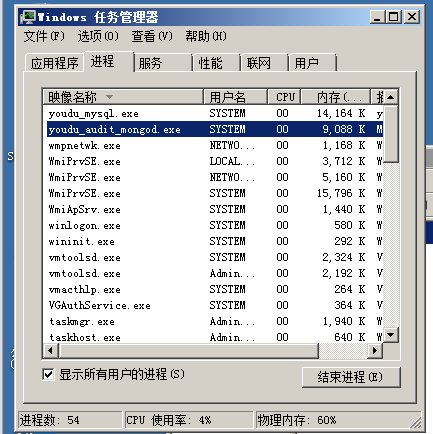
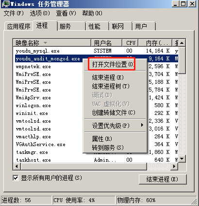
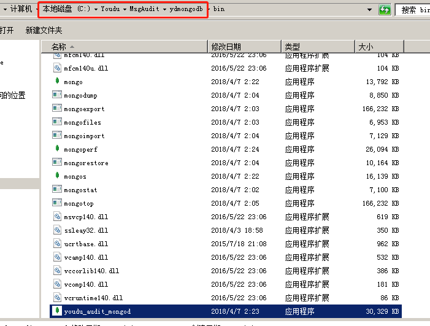
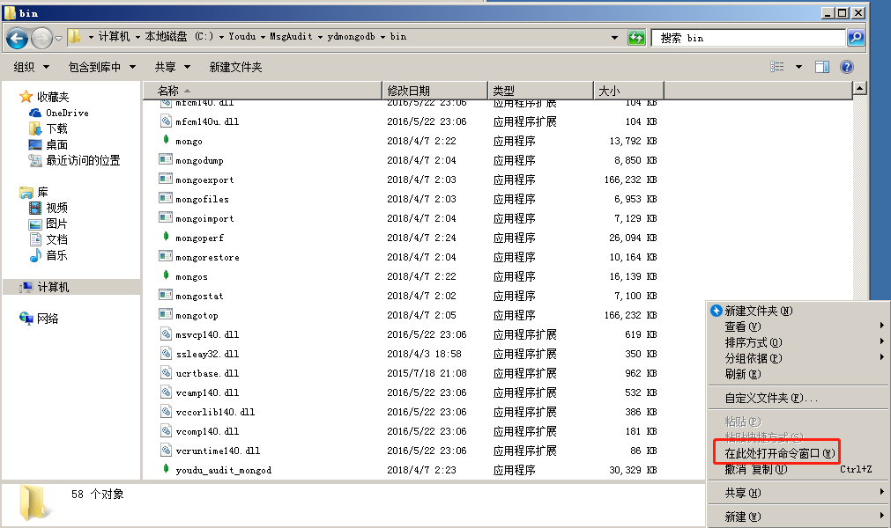
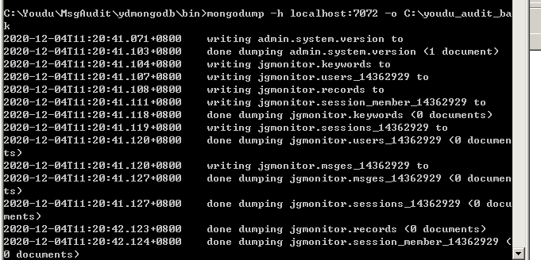
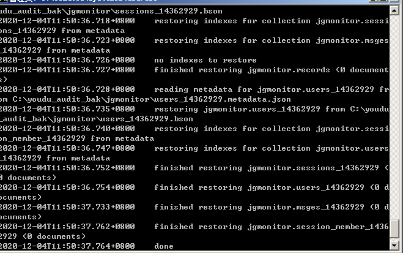

# Windows版导出导入 

## 导出

## 进入消息审计的数据库安装目录

默认安装在D:\Youdu\MsgAudit，如果您不确定，可以按照以下方法定位程序所在位置：

1.任务管理器找到youdu_audit_mongod.exe。



2.右键进程，点击“打开文件位置”。



3. 截图红框所示，就是消息升级插件的数据库安装目录：



## 停止消息审计服务并禁用

 打开系统服务，找到youdu_audit服务。

- 停止：

 右键停止服务即可。

- 禁用：

 右键属性，选择启动类型为“禁用”，点击“应用”，“确定”。

## 检查进程是否在运行

 打开任务管理器，点击进程，键入jgauditor,如果没有jgauditor.exe.说明消息审计已经停止成功。

## 导出数据

1.按住shift键，同时右键空白区域，点击“在此处打开命令窗口”。



2.执行导出数据命令。例如：

```
mongodump -h localhost:7072 -o C:\youdu_audit_bak
```

> 文件路径以您的实际路径为准。



## 拷贝导出数据到新服务器

 可以对youdu_audit_bak目录压缩后再进行拷贝，压缩级别可以设为0。

# 导入

## 安装消息审计插件

安装完成后，继续进入下面的步骤，无需做其它设置。

## 停止消息审计服务

 打开系统服务，找到youdu_audit服务，右键停止服务即可。

## 上传数据并解压

 将导出的数据上传到新服务器，解压。

## 导入数据

1.进入消息审计的数据库bin目录，例如C:\Youdu\MsgAudit\ydmongodb\bin

2.按住shift键，同时右键空白区域，点击“在此处打开命令窗口”。


3.执行导入数据的命令。例如：

```
mongorestore /h localhost:7072 /dir C:\youdu_audit_bak
```

> 文件路径以您的实际路径为准。



## 注意事项

如果迁移后，消息审计插件与有度服务端不在一个服务器，即场景二，需要根据补充说明再调整配置参数：[点击跳转链接](e01_00004.md)


