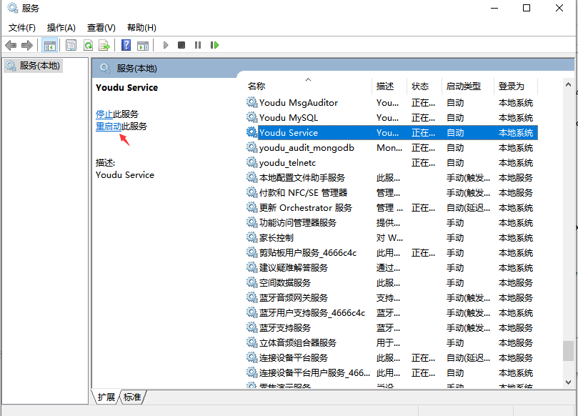

## 安装有度服务端

> 如果已经安装，可以跳过此步。

​		先安装服务端，安装完成导入License，直接进入下面的步骤。

## 运行命令提示符（CMD）

1. 同时按下win+R键；
2. 输入cmd；
3. 回车；


## 运行jgbackup-restore

1. 进入服务端安装目录/Youdu/server/bin。
2. 将jgbackup-restore.exe拖进命令提示符窗口。


## 添加参数

```
jgbackup-restore r -d 自动备份数据路径

r #修复动作
-d #指定需要恢复的数据路径
```

> 一般选择最新的备份数据进行恢复。

## 开始数据恢复


## 恢复完成


## 重启有度服务



## 测试客户端功能

1. 退出客户端，测试登录，登录过程正常即可。

2. 任意打开会话，发送文字消息，消息记录有同步显示，说明消息功能正常。

3. 任意打开会话，发送图片或文件，消息记录有同步显示，说明文件功能正常。

4. 任意打开应用，如工作汇报、网盘，可以正常打开、使用，说明应用功能正常。

   如果发现数据恢复后，服务端或客户端存在异常，请提交工单。