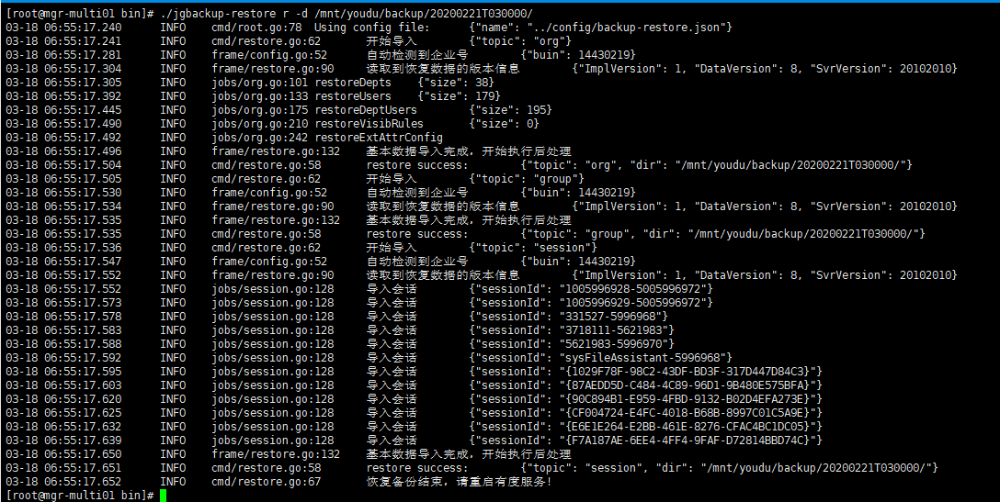

## 安装有度服务端

> 如果已经安装，可以跳过此步。

​		先安装服务端，安装完成导入License，直接进入下面的步骤。

## 进入安装目录下的bin目录

```
cd /path/bin
```

##　运行jgbackup-restore

​		添加参数，并指定路径。例如：

```
./jgbackup-restore r -d /mnt/youdu/backup/20200221T030000/

r #修复动作。
-d #指定需要恢复的数据路径。
```

## 导入完成



## 重启有度服务

```
systemctl restart youdu_service
```

## 测试客户端功能

1. 退出客户端，测试登录，登录过程正常即可。

2. 任意打开会话，发送文字消息，消息记录有同步显示，说明消息功能正常。

3. 任意打开会话，发送图片或文件，消息记录有同步显示，说明文件功能正常。

4. 任意打开应用，如工作汇报、网盘，可以正常打开、使用，说明应用功能正常。

   如果发现数据恢复后，服务端或客户端存在异常，请提交工单。