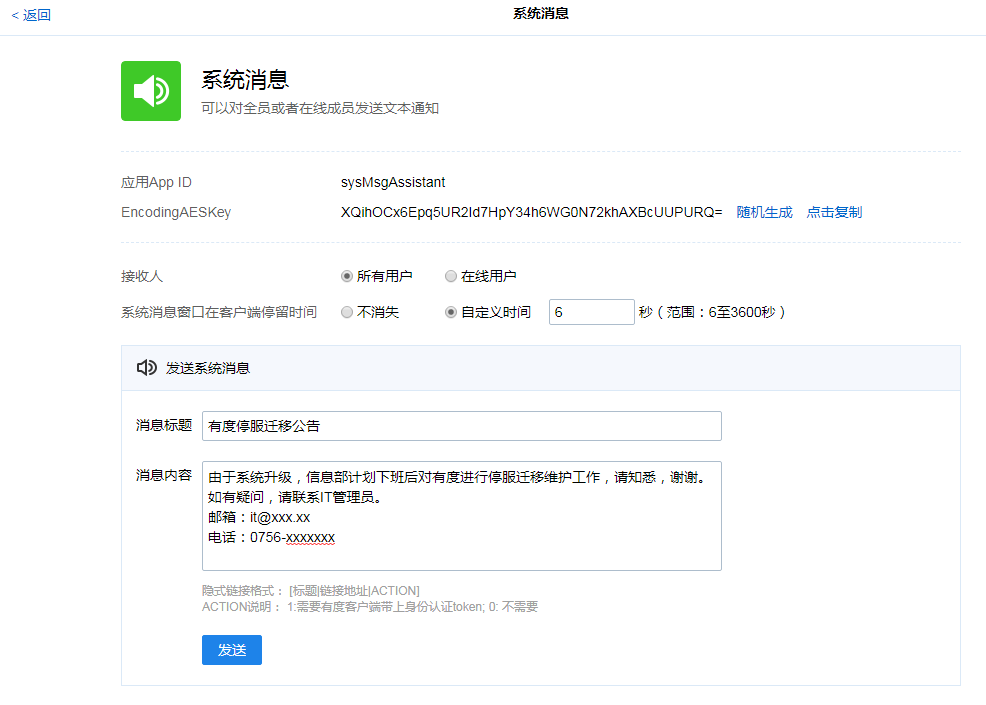

## 说明

- 如果您看完此文后仍对迁移有疑问，可以搭建一个测试环境进行模拟实验。
- 请您务必严格根据此文指引操作，否则可能引发故障，如有疑问可以提交工单或联系我们。
- 我们可以协助管理员进行迁移，优先支持付费客户。

## 关于迁移的数据范围

- 默认情况下，迁移所有数据。
- 为了加快迁移速度，建议优先迁移除了文件以外的数据，文件可以后续再进行同步，例如利用第三方工具在后台同步。优先保证服务对外可用，减少停服时间。
- 如果您不需要保留文件，可以不用迁移文件，对客户端的使用没有影响，客户端本地已经下载的文件依然可以正常读取。
- 我们无法给出您的数据迁移时间，因为这个和数据量大小、实际迁移过程中的认为协作、网络速度等有关。但是通常不迁移文件的情况下，2小时内可以完成。

## 注意事项

> 请严格遵循！
>
> 请严格遵循！
>
> 请严格遵循！

- 迁移前，请对数据进行备份，以防万一。
- **【请重视】迁移开始及迁移过程中，旧服务器、新服务器的有度服务必须处于绝对的停止状态，否则可能引发故障。**如果您单位无法接受，建议另外安排时间，或暂不迁移。
- **【请重视】新服务器数据导入完成确认无误后，才能切换到新服务器，由新服务器对外提供服务，旧服务器作废。**
- 即使迁移过程中遇到问题，**切勿直接对旧服务器的服务进行恢复，包括虚拟机快照等功能进行恢复，否则可能引发故障。**只有迁移时，新服务器出现问题后，且确认客户端没有连上过新服务器后，才能对旧服务器进行恢复（直接启动服务）。
- 如有任何疑问、问题，请提交工单或联系我们协助处理。如果您没有遵循我们文档操作或者操作失误导致严重故障，最严重的后果是服务器消息记录丢失，请您知悉。

## 提前发布停服公告

​		您确认迁移时间后，可以通过有度的系统消息或者广播消息发布停服公告。例如系统消息：

​		登录有度后台，点击“管理工具”，“系统消息”。

