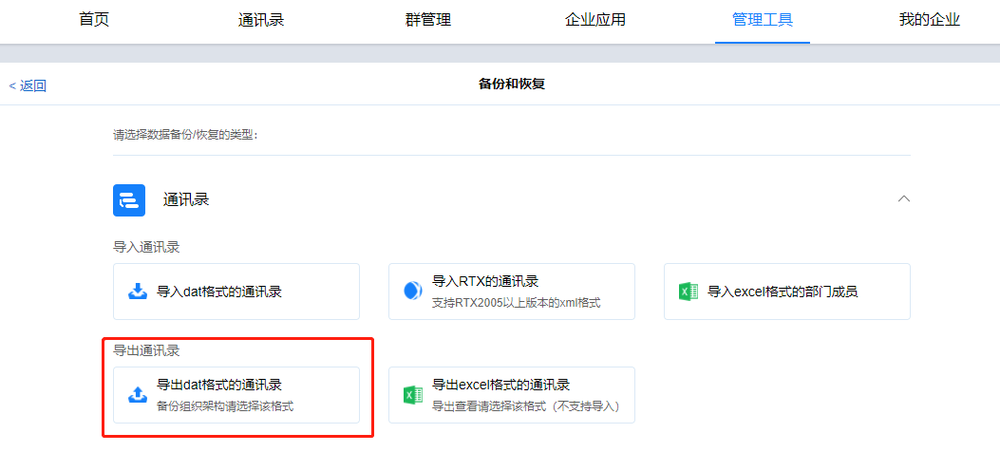
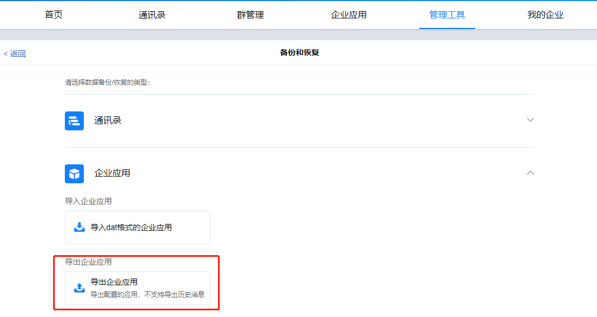

## 说明

​		<u>*本文是对关键数据进行备份，并不是您需要迁移的数据。*</u>

## 备份通讯录

​		登录管理后台，点击“管理工具”，“备份和恢复”，"通讯录"，“导出dat格式的通讯录”。

## 备份企业应用

​		登录管理后台，点击“管理工具”，“备份和恢复”，“企业应用”，“导出企业应用”。

##　拷贝自动备份数据

​		进入服务端安装目录/backup，拷贝最新一天的数据。