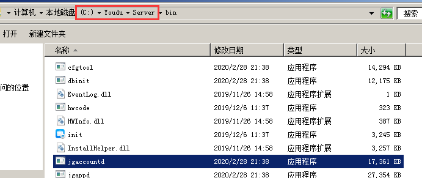

## 检查工作

​		在您正式开始迁移数据之前，请先对以下事项进行检查。

- [ ] 已对关键数据进行备份；
- [ ] 已提前发布停服公告；
- [ ] 迁移对旧服务器、新服务器的服务端版本要求一致。请您确认旧服务器已经升级至当前官网最新版本，如果版本较低，您需要先进行升级，如果是32位系统，可以联系我们协助进行迁移到64位，然后再进行迁移；
- [ ] 新服务器的网络规划已经就绪，例如静态IP设置，或者迁移完毕后调换旧、新服务器的IP地址；
- [ ] 新服务器的系统是全新的；
- [ ] 您理解并知悉旧服务器全程停服的要求，请务必严格遵循；

## 进入安装目录

​		默认安装在D:\Youdu\Server，如果您不确定，可以按照以下方法定位程序所在位置：

​		打开任务管理器，点击进程-按照映象名称排序（进程名称排序），键盘输入jg，任意右键一个jg开头的进程，点击打开文件位置。例如：

​		截图红框所示，就是安装目录：



## 停止有度服务并禁用

​		打开系统服务，找到youdu_service服务。

- 停止：

  ​	右键停止服务即可。

- 禁用：

  ​	右键属性，选择启动类型为“禁用”，点击“应用”，“确定”。

## 检查进程是否在运行

​		打开任务管理器，点击进程，没有jg开头的进程在运行，说明有度服务已经停止成功。

## 新建youdu_backup目录

​		将所有导出的数据放在youdu_backup目录，方便后续操作。

## 导出config目录

​		复制config目录到youdu_backup目录。

## 导出db目录核心数据

1. 在youdu_backup目录下，新建db目录。
2. 进入安装目录下的db目录，拷贝核心数据文件夹：ent_app_logo、leveldb
3. 数据说明

- 核心数据

```
ent_app_logo #企业应用logo
leveldb #聊天记录
```

- 文件相关的数据，可以后续再拷贝，同步。

```
avatar #头像
files #单人、讨论组、应用的文件数据。服务器不存P2P文件，不包含P2P文件。
rca_files #企业互联的历史文件。如果没有使用企业互联功能，可以忽略。
org #服务端生成的组织架构文件，供客户端下载，即使没有拷贝也不影响客户端使用，可以自动重新生成。
netdisk_files #网盘、群空间（固定群）的文件数据。
```

## 导出MySQL数据

1. 进入mysql的bin目录，例如C:\Youdu\Server\ydmysql\bin

2. 按住shift键，同时右键空白区域，点击“在此处打开命令窗口”。

   

3. 执行导出数据命令，例如：

   默认的mysql密码是root。

```
mysqldump -uroot -p -A > D:\youdu_backup\youdu_all.sql
```

> 文件路径以您的实际路径为准。

## 拷贝所有数据到新服务器

​		可以对youdu_backup目录压缩后再进行拷贝，压缩级别可以设为0。