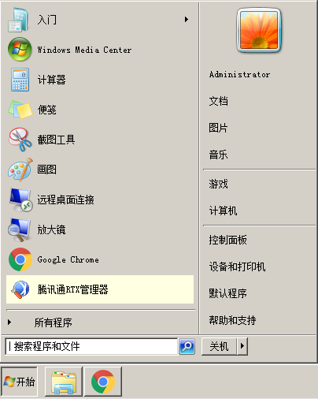
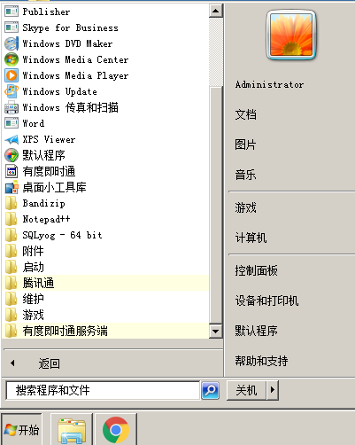
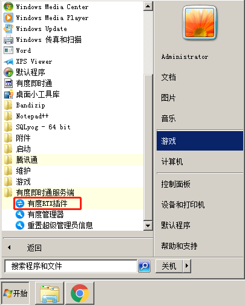
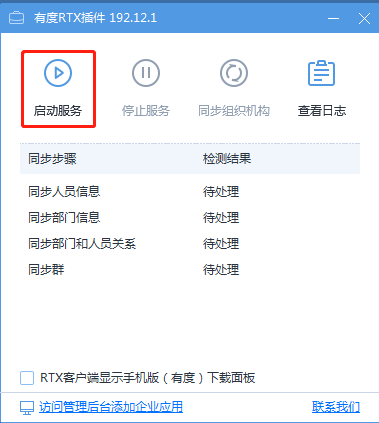
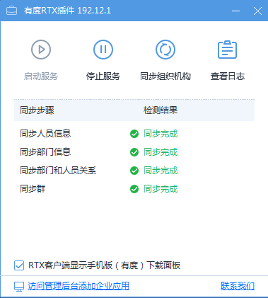

# RTX手机版本地部署版安装指南（一）

如果您需要将有度即时通的服务端和RTX服务端部署在同一台服务器上，可参考此文档。

##　安装有度服务端

请参考：[有度服务端安装](a01_00001.md)

## 启动有度RTX插件同步服务

1.点击“开始”菜单

2.点击“所有程序”

3.点击”有度即时通服务端“

4.点击”有度RTX插件“

5.点击”启动服务“

6.检测结果为”同步完成“，说明同步成功

