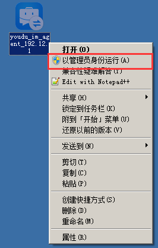
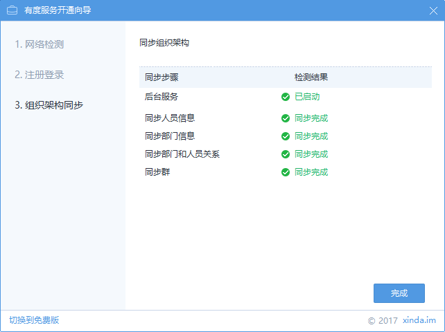

## 云免费版配置

1. 在RTX服务器上，以管理员身份运行插件。

2. 点击安装。

3. 点击完成。

4. 输入RTX总机号，点击“下一步”。

5. 同步完成

5. 注册或登录后，即可使用，客户端通过总机号登录有度即可。

## 本地部署版配置

### 有度服务器安装有度服务端

   详情请查看服务端安装指南

### RTX服务器安装、配置有度RTX插件

1. 以管理员身份运行插件。

2. 点击“安装”。

3. 点击“完成”。

4. 点击“切换到本地部署版”，点击“确定”。

5. 输入有度服务器IP地址。

如果此步不通，请检查有度服务器是否开放7080,7443,7014的TCP端口访问。

6. 输入连接码

登录有度管理后台，点击我的企业-高级设置-RTX集成，即可查看连接码。

7. 同步完成

8. 有度客户端设置有度服务器地址，使用RTX帐号即可在有度登录。