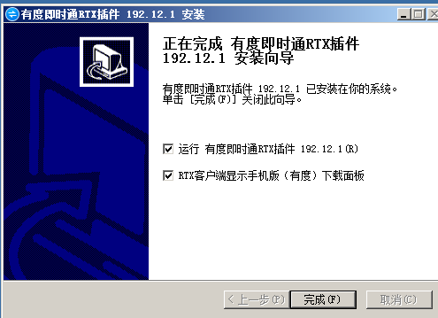
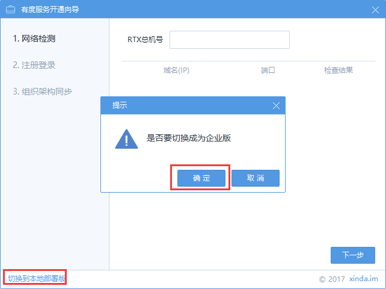
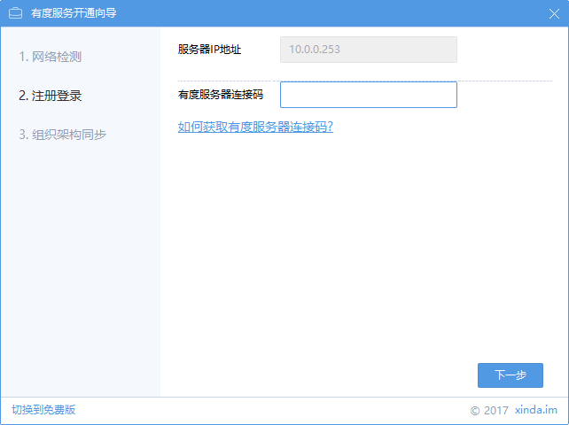
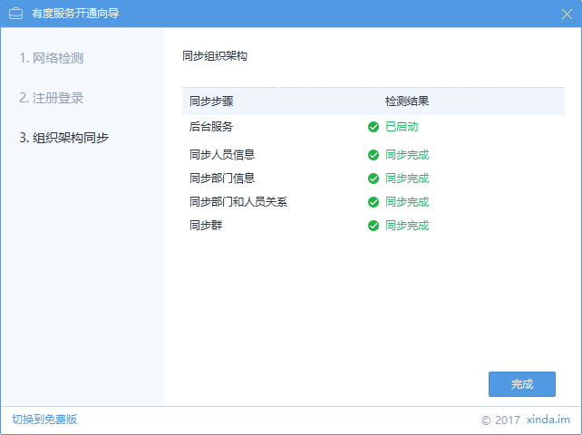

# RTX手机版本地部署版安装指南（二）

如果您需要将有度即时通的服务端和RTX服务端部署在** 不同 **的服务器上，可参考此文档。

## 有度服务器

请参考：[有度服务端安装](a01_00001.md)

安装完成后，有度服务器需另外开放端口7014，协议是TCP。具体可以参考[防火墙策略](a01_00004.md)。

## RTX服务器

1.以管理员身份运行插件。

2.点击“安装”。

3.点击“完成”。

4.点击“切换到本地部署版”，点击“确定”。

5.输入有度服务器IP地址。

如果此步不通，请检查有度服务器是否开放7080,7443,7014的TCP端口访问。

6.输入连接码

登录有度管理后台，点击“我的企业”，“高级设置”，“RTX集成”，即可查看连接码。

7.同步完成

