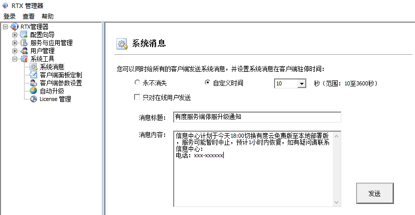

## 发布停服升级维护公告

　　开始之前，您可以通过RTX的系统消息发布公告。例如：

## 导出云免费版组织架构

1. 联系有度技术支持，提供总机号，说明目的是从云免费版切换到本地部署版。
2. 登录云免费版管理后台，导出组织架构

https://youdu.im/userportal/login.html

> 问：导出组织架构的目的？  
> 答：本地部署的有度服务端没有云版数据，有度客户端的会话、聊天记录可能会丢失。为了保证客户端本地的数据还能加载显示，需从云免费版导出组织架构，有度客户端才可以匹配本地的会话数据。
>
> 问：RTX会和有度本地部署进行同步，为何还需要从云免费版导出？  
> 答：RTX不带gid字段，有度客户端本地无法通过此字段来匹配本地的会话数据。云免费版、本地部署版均包含gid。
>
> 问：为何云免费版会有组织架构？  
> 答：有度客户端无法直接获取RTX服务端数据，需要在有度上同步一份提供给有度客户端使用，插件对数据已经做加密处理。

## 根据您的有度服务端实际部署情况继续下一步

- 如果您的有度服务端计划安装在RTX服务器上，请查看[RTX、有度单机配置](#RTX、有度单机配置)。
- 如果您的有度服务端计划安装在其它机器，与RTX不在一个服务器上，请查看[RTX、有度分布式配置](#RTX、有度分布式配置)。

## RTX、有度单机配置

1.卸载有度RTX插件

2.安装本地部署版有度服务端

　　请查看[安装指南](admin/server_install/server_install)

3.启动插件同步服务

　　开始菜单-有度即时通服务端-有度即时通RTX插件，点击“启动服务”。

## RTX、有度分布式配置

1.有度服务器安装有度服务端

详情请看[安装指南](admin/server_install/server_install)。

2.有度服务端导入组织架构

3.RTX服务器卸载有度RTX插件

4.RTX服务器安装、配置有度RTX插件

  　　详情请看[有度RTX插件的本地部署版配置](admin/rtx/rtx_agent/rtx_agent?id=本地部署版配置)

## 本地环境配置完成，联系有度技术支持禁用云免费版

　　以上步骤完成后，联系有度技术支持停止您单位的云免费版，帐号会被踢出下线，重新登录即可。

## 关于外网客户端登录的服务器地址设置说明

　　本地部署版的服务端是部署在您单位内部，客户端需要访问服务器才可以登录。例如服务器设置填写IP地址或域名。

　　这意味着，如果您需要外网登录，您需要满足以下条件之一：

- 您的服务器内部网络具备出口公网IP，并且是固定的；
- 您的路由器支持动态域名，并已经配置；

接着您需要配置端口映射，放通防火墙入站：7006,7080,7443,均是TCP协议。配置完成后，您就可以在外网使用外网地址进行登录。

如果以上条件不满足，可以使用我们的远程登录功能，此功能属于增值服务，需要可以[联系商务](https://youdu.im/contact.html)。

## 关于总机号登录

　　如果想保留云免费版的通过总机号登录，在满足外网登录的条件下，将总机号、外网地址发给有度技术支持处理即可。