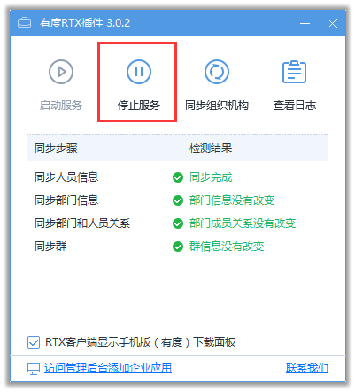
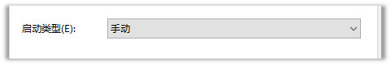
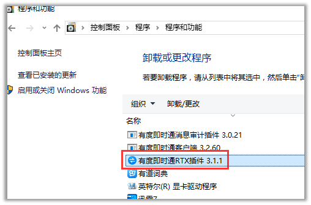
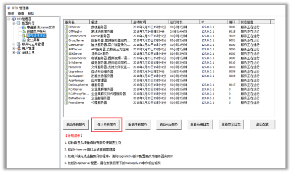

## 说明

　　腾讯通RTX与有度即时通本质上属于两套互相独立的系统，通过有度RTX插件服务实现并行使用、消息互通；那么，需要从腾讯通RTX全面切换有度使用的情况，一般是经过了一段时间的并行使用的过渡期之后，为了方便运维，可直接全面切换有度即时通使用，停止与腾讯通RTX的并行。

## 操作说明

1. 在停止腾讯通与RTX并行使用前，应由管理员发布系统消息，告知所有用户。

2. 停止有度RTX插件服务

   1)有度服务端与腾讯通RTX服务端部署在同一台服务器上时，操作如下：

-  方法一：打开有度 RTX 插件，点击“停止服务“。
   

- 方法二：打开系统服务，停止以下服务，并将启动类型改为手动或禁用即可

　　服务：Youdu Agent、Youdu Msg；

 

 

   2)有度服务端与腾讯通RTX服务端分开部署时，操作如下：

- 打开控控制面板-程序-程序和功能-卸载有度即时通RTX插件，即可断开并行状态；
 

3. 如果无需在使用腾讯通RTX，可直接停止腾讯通RTX服务。

- 打开 RTX 管理器-服务运行状态，点击“停止所有服务“。

 

4. 完成全面切换有度即时通使用。