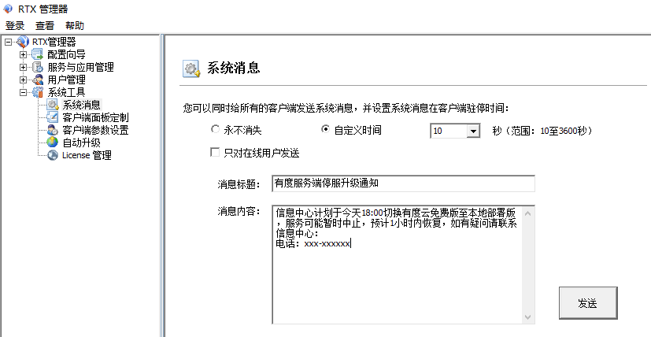
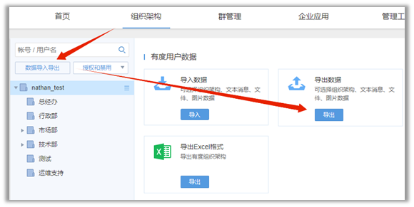
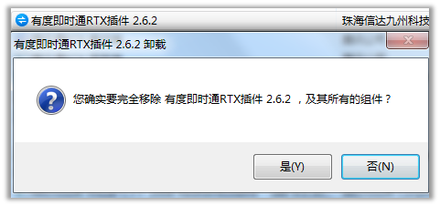
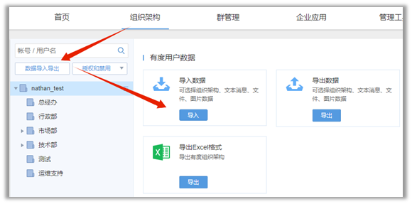

# 云免费版升级本地部署版

## 发布停服升级维护公告

　　开始之前，您可以通过RTX的系统消息发布公告。例如：

## 导出云免费版组织架构

1. 联系有度技术支持，提供总机号，说明目的是从云免费版切换到本地部署版。
2. 登录云免费版管理后台，导出组织架构

[https://youdu.im/userportal/login.html](https://youdu.im/userportal/login.html)

**问：导出组织架构的目的？**
答：本地部署的有度服务端没有云版数据，有度客户端的会话、聊天记录可能会丢失。为了保证客户端本地的数据还能加载显示，需从云免费版导出组织架构，有度客户端才可以匹配本地的会话数据。

**问：RTX会和有度本地部署进行同步，为何还需要从云免费版导出？**
答：RTX不带gid字段，有度客户端本地无法通过此字段来匹配本地的会话数据。云免费版、本地部署版均包含gid。

**问：为何云免费版会有组织架构？**
答：有度客户端实际上登录的是有度服务端，所以插件需要同步RTX数据至云免费版，我们已经对数据做加密处理。**建议您使用本地部署版，数据完全自主可控。**

## 卸载有度RTX插件

> 提示：
>
> 直接卸载即可，不影响数据。

## 安装本地部署版有度服务端

请参考：[有度服务端安装](a01_00001.md)

根据您的实际需要，选择部署方式。

- 场景一：本地部署版，装在RTX服务器上

  安装完成后，直接打开插件，启动同步。

- 场景二：本地部署版，准备一个新服务器，独立部署有度服务端

  1.新服务器直接按照指南进行有度服务端的安装；
  2.RTX服务器安装有度RTX插件，配置时连接到新服务器，即本地部署版的有度服务端。

## 有度服务端导入组织架构

## 迁移完成

​		以上步骤完成后，即可登录本地的有度服务端，默认使用服务器地址登录。

　　如果想保留云免费版的总机号登录，在满足[外网登录](a01_00001.md)的条件下，将总机号、外网地址发给有度技术支持,我们会帮您绑定总机号为您的外网地址。

## 禁用云免费版

　　以上步骤完成后，有度客户端如果没有重新登录，实际上依然是云免费版在线。您可以联系我们将云免费版禁用，帐号会被踢出下线，重新登录即可。

