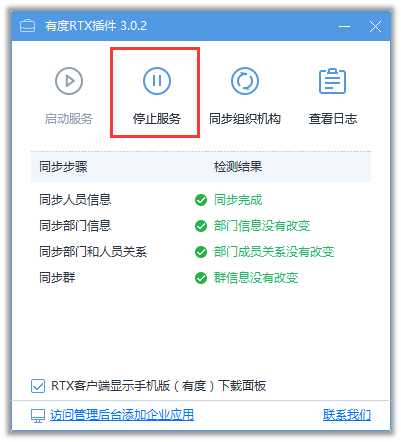

# RTX全面切换到有度

##　腾讯通RTX发布切换通知

在停止腾讯通与RTX并行使用前，管理员在腾讯通管理器发布系统消息，告知所有用户停用腾讯通RTX，并提供有度即时通客户端的下载地址。例如：

## 卸载或禁用有度RTX插件

### 本地部署版（RTX服务器）

1.打开有度 RTX 插件，点击“停止服务“。

2.打开系统服务，停止以下服务，**并将启动类型改为手动或禁用**。

　　服务：Youdu Agent、Youdu Msg；

 

 

### 本地部署版（独立部署）

1.登录RTX服务器

2.打开控控制面板-程序-程序和功能-卸载有度即时通RTX插件，即可断开并行状态。

3.如果不再使用腾讯通RTX，可直接停止腾讯通RTX服务。

​		打开 RTX 管理器-服务运行状态，点击“停止所有服务“。

 

4.您也可以对腾讯通RTX服务端进行卸载，打开控控制面板-程序-程序和功能-卸载"腾讯通RTX服务端"。

5.完成全面切换有度即时通使用。

### 云免费版

建议您先将有度服务端升级到本地部署版：[点击跳转](g01_00005.md)