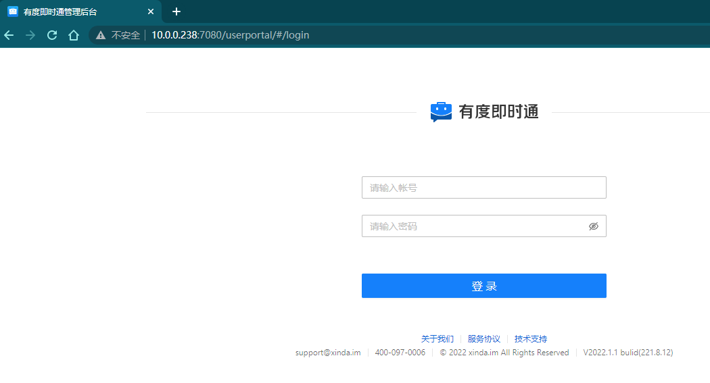
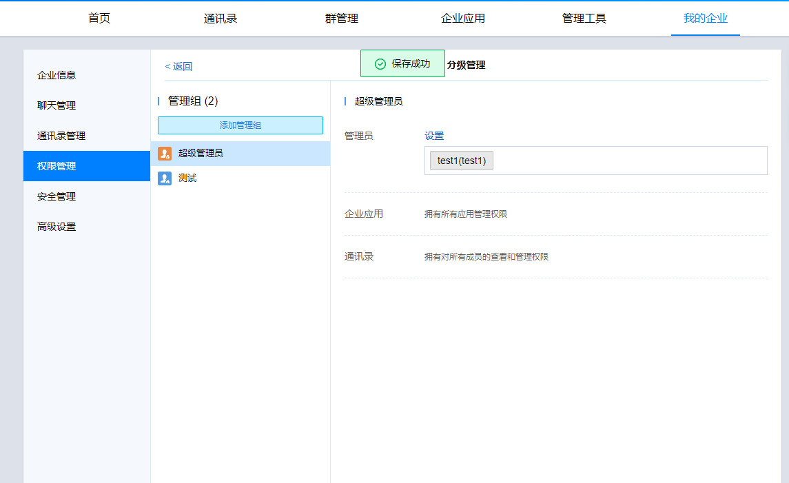

### 一、如何访问有度管理后台

  打开浏览器，输入有度管理后台地址：http://服务器IP:7080/userportal/

  建议通过谷歌、火狐等浏览器访问。使用360等浏览器时，建议切换到Chrome内核、极速模式。

### 二、如何添加多个有度后台管理员

  有度管理后台支持添加多个管理员具体操作如下：

  访问有度管理后台-【我的企业】-【权限管理】-【分级管理】-【超级管理员组】-【设置】，勾选组织架构中需要添加管理员权限的账号即可。

