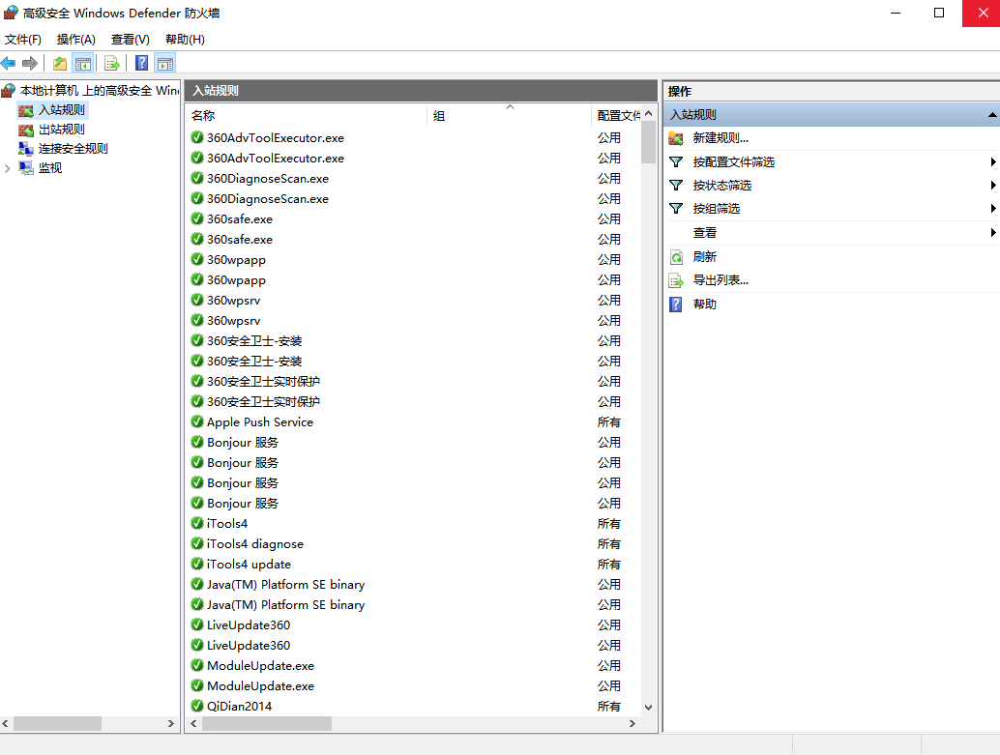

### 一、Windows系统-防火墙端口开放

环境：Windows server 2008以上，win7及以上；

1. 打开控制面板——Windows防火墙，单击左侧的“高级设置”。



2.选中入站规则，右键单击“新建规则”。

3.单击“端口”，下一步。

4.输入7006,7080,7443。此处注意逗号为半角“,”


5.继续下一步。

6.输入规则名称，完成即可。


### 二、Linux防火墙如何开放端口
#### Firewall

```
firewall-cmd --zone=public --add-port={7006,7080,7443}/tcp --permanent && firewall-cmd --reload && firewall-cmd --zone=public --list-ports
```

#### Iptables

```
iptables -I INPUT -p tcp -m multiport --dports 7006,7080,7443 -j ACCEPT && service iptables save && service iptables restart
```

