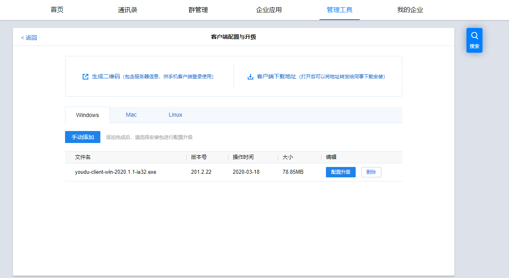

### 一、如何配置客户端升级

  登录有度管理后台，在【管理工具】-【客户端配置与升级】中，点击手动添加最新版本有度客户端进行配置升级；

客户端在重新登录之后，便会收到服务端的新版本下载推送通知，升级使用即可。

### 二、有度客户端内置浏览器用的什么内核

1、 iOS、Mac端使用的是系统自带的webkit内核webview浏览器；Mac端部分情况会直接调用系统默认浏览器。

2、 android客户端用的是系统自带webkit内核webview浏览器

3、Windows客户端用的Webkit内核webview浏览器

### 三、有度客户端内置浏览器的缓存时间是多久，用户是否可以控制缓存时长

  有度客户端目前没有加缓存；企业自己的WEB应用，可以在服务器返回的响应头中加入Expires策略或者Cache-Control策略来告诉客户端应该执行的缓存行为，同时配合#Last-Modified#等头来控制刷新的时机。

### 四、有度客户端发送消息到服务器的流程

1、客户端通过TCP(TLS Socket)通道登录成功，服务器返回用于https信息交互的token。

2、客户端将发送消息内容先进行base64，然后放进json协议包。

3、客户端将json协议包和token，通过https协议提交给服务器。

4、服务器验证token身份合法，将整个json数据包进行加密，把加密后的消息保存进leveldb或mongdb数据库。

### 五、有度客户端都支持哪些设备

| 设备编号 | 设备名称         | 设备编号 | 设备名称                 |
| -------- | ---------------- | -------- | ------------------------ |
| 0        | PC；各类台式电脑 | 6        | Web客户端（已停止支持）  |
| 1        | 苹果iphone手机   | 7        | 微信企业号（已停止支持） |
| 2        | 苹果ipad         | 9        | 华为手机                 |
| 3        | 各类android手机  | 10       | 小米手机                 |
| 4        | 各类android Pad  |          |                          |
| 5        | 苹果Mac电脑      |          |                          |