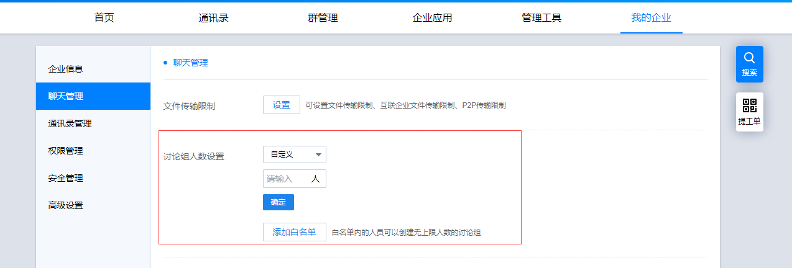

## 一、有度客户端消息收发过程

1、客户端通过TCP(TLS Socket)通道登录成功，服务器返回用于https信息交互的token；

2、客户端将发送消息内容先进行base64，然后放进json协议包；

3、客户端将json协议包和token，通过https协议提交给服务器；

4、服务器验证token身份合法，将整个json数据包进行加密，把加密后的消息保存进leveldb或mongdb。

## 二、消息收发失败

1、检查服务器网络是否正常；

2、检查服务器磁盘空间是否充足；

3、检查mysql服务是否正常；

4、检查服务器的整体运行情况，包括CPU。

## 三、如何手动修改讨论组人数上限
1、登录管理后台，打开【我的企业】-【聊天管理】-【讨论组人数设置】；

根据实际需要进行讨论组人数的设定

2、如需设定特殊账号不限制讨论组人数上限，则可以【添加白名单】即可；白名单内的账号，在创建讨论组时，无上限限制。

