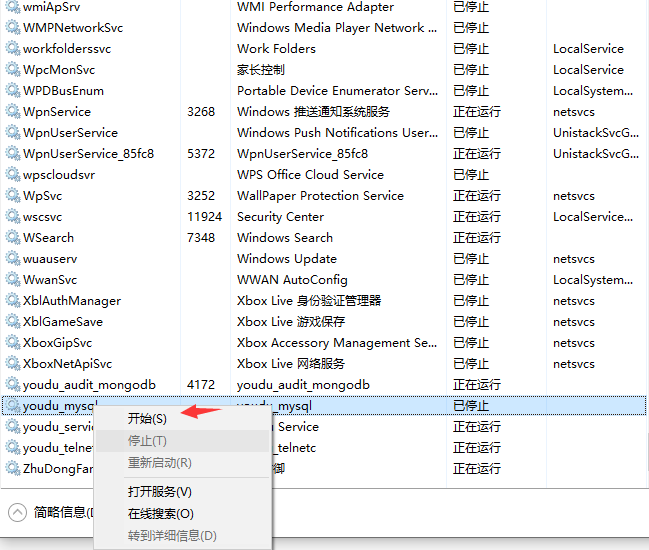

## 一、文件传输失败

1. 测试文字消息是否正常；

2. 如果文字消息正常，直接检查服务器的jgfile服务。如果文件服务独立部署，直接查看文件服务器情况；

3. 服务器磁盘空间是否充足。

   

## 二、文件收发失败，服务器返回503服务不可用

说明：服务器有触发文件服务停止的机制。当服务器的CPU使用率达到95%以上，jgproxy会停止文件服务（jgfile），所以请求会无法响应，这是为了防止服务器的性能进一步恶化。

出现此情况，说明服务器的CPU负荷较高，待服务器CPU资源恢复正常后即可。请及时查看是哪些进程占用高导致的，如果是进程问题，联系我们分析，如果是服务器性能不足，请扩容CPU。建议您关注服务器性能情况，必要时可以考虑[文件服务独立部署](a01_00013.md)。

如果想关闭或调整策略，可以编辑配置文件config/jgproxy.ini，修改[common]段，修改完毕后重启jgproxy生效。以下是说明：

```
cpuMonitorOn
#开关，默认为1开启，0关闭。

maxPermitCpuUsage
#CPU使用率触发阈值，默认95（%）。

cpuMonitorCheckDuration
#监控间隔，默认5秒
```


## 三、如何限制用户传输文件大小

　　登录有度管理后台，在【我的企业】-【聊天管理】-【文件传输限制】中。可对单个文件传输大小、P2P文件传输、互联企业文件传输进行限制，以达到限制用户传输文件大小目的。


## 四、如何修改服务端文件的存储路径

以Windows服务端为演示示例

　　有度服务端文件存储位置为安装路径下db目录中，如Youdu\Server\db。

如果需要修改默认路径，则需要添加配置项，指定存储路径。

操作如下

1、停止有度服务


2、修改配置文件，添加配置项

   打开Youdu\Server\config\svrlist.ini 。（以实际安装路径进行确认）


　　找到jgfiled、jgnetdiskd项，分别添加路径配置项

示例：

请添加您的实际路径。

```
private.storepath = E:\youdu_files点击复制 (Click to Copy)错误 (Error)复制 (Copy)
```


3、拷贝Youdu\Server\db路径下相关目录至新路径

请您根据实际需要，考虑是否拷贝，或者只拷贝近期数据，例如保留最近30天的文件数据。

　　目录列表：
　　文件服务。jgfile：avatar、files、off_files、org、rca_files、resum_files
　　网盘服务、群空间：jgnetdisk：netdisk_files


4、启动有度服务



5、登录客户端进行文件收发，测试下载历史文件，测试通过，则文件存储路径修改完成

> 注意：文件路径修改完成之后，此后服务端的文件数据都会存放至新路径，旧路径的相关目录可进行删除，释放空间。


## 五、如何关闭文件自动上传群空间的功能

　　提供版本：有度服务端2020.1及以上版本

1、修改 config/svrlist.ini 文件，[jgfiled] 下添加以下参数

　　`private.nonAutoSaveGroupFile = 1`

2、重启文件服务；

在任务管理器中选中jgfiled.exe进程，点击结束任务即可，服务会自动重启恢复。


3、参数说明

```
0：存储。默认没有此项，为开启；

1：不存储。
```


## 六、有度客户端文件上传网盘失败

1、确认服务器磁盘空间是否充足；

2、在有度服务器进程中，尝试重启网盘相关服务，如jgmino和jgnetdiskd；

在任务管理器中，选中 jgminio.exe和jgnetdiskd.exe两个进程，点击结束任务即可（系统会自动重启）。


