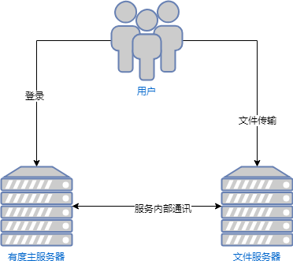
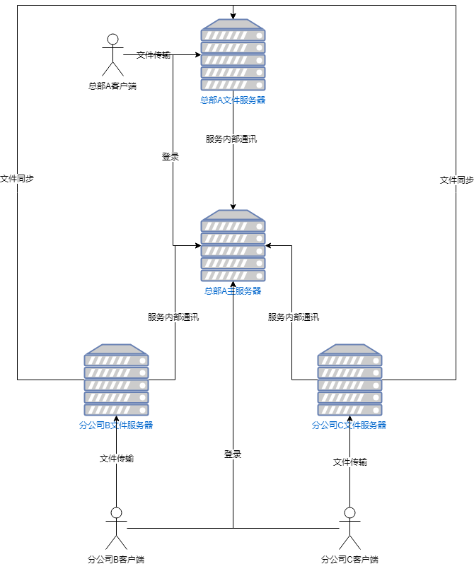

#### 1.文件服务独立部署

##### 场景描述

当服务器有大量的文件读写在进行，会导致磁盘IO、CPU、网络带宽等资源占用较高，可能会影响其它服务的正常运行。有度支持拆分文件服务独立部署，可以减轻主服务器压力，防止因文件服务的资源占用影响整体服务的运行

##### 拓扑图示例

 

##### 实现逻辑

1、客户端向主服务器获取文件服务地址。

2、客户端与文件服务器建立连接。

3、文件服务器与主服务器鉴权用户权限。

4、鉴权成功，开始文件传输。

#### 2. 多文件服务部署

##### 场景描述

大型企业的组织架构规模较大，除了总部还有多个分公司。为了提高分支公司的传输速度，降低总部的文件服务压力，各个分支公司可以在自己的网络内单独部署文件服务器，且能满足多个地点之间文件同步。

##### 拓扑图示例：

##### 实现逻辑

1、客户端向总部主服务器获取自己的文件服务地址。

> **注意：** 如果A、B、C的登录地址相同，可根据客户端本地的网段做网络识别判断。如果A、B、C的登录地址不同，可根据不同的登录地址判断返回相应的文件服务器地址。对于外网客户端，可以一律返回A的文件服务器地址。

2、客户端与相应文件服务器建立连接。

3、文件服务器与主服务器鉴权用户权限。

4、鉴权成功，发送方开始文件传输。如果发送方是分公司客户端，在上传完毕后，其所属文件服务器将会通知总部服务器，该文件在该分公司文件服务器。

>**例如：**B客户端发送文件后，B文件服务器会告知A文件服务器（总部），该文件存储于B文件服务器。A文件服务器记录了所有文件的位置。

5、接收方收到文件时，向其所属文件服务器请求文件下载，其所属文件服务器如果没有该文件，将询问A文件服务器（总部）请求文件位置，获取到文件位置后进行下载，并返回给接收方。若此节点有第二个客户端下载该文件，由于该文件服务器已经存储了此文件，该文件服务器将直接返回文件给客户端。

>**例如：**C客户端下载文件时，C文件服务器并没有该文件，向A文件服务器（总部）询问文件位置，在得知该文件位于B文件服务器时，C文件服务器会向B文件服务器下载该文件，并将该文件进行存储。若有第二个C客户端下载该文件，C文件服务器直接返回该文件给C客户端。