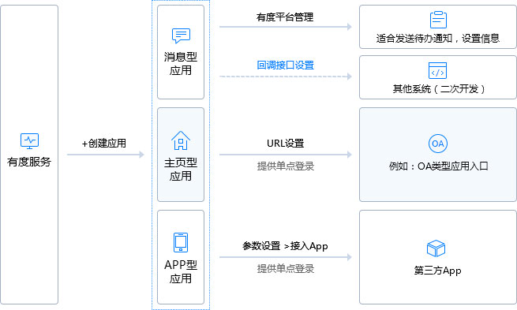

# 开发前必读

> 本文档适合熟悉程序开发人员使用。

有度即时通提供的SDK示例基于服务端API开发，SDK示例为JAVA语言版本，其他开发语言可参考SDK示例中的集成场景。

API接口使用统一的格式处理接口的请求/返回，详情请参考[服务端API全局说明](c01_00002.md)。非统一的接口会在文档最前面标明。

在使用本文档时，出现异常情况，请联系我们。

## 什么是总机号

总机号是在导入有度颁发的授权文件时，有度服务读取到的总机号。

总机号可用于标识对应的企业信息。

在有度管理后台我的企业中可查看到企业的总机号。

## 什么是企业应用

有度接口以“应用”类型进行划分，不同类型的应用拥有不同的接口权限，注意：不能拿A类型应用去调用B类型应用接口，否则将抛出：invalid appId异常。

企业应用主要解决“人”与“系统”之间的交互协作，如：业务系统产生待办事件，可以通过应用将消息推送给客户端，实现以事务驱动办公。客户端也可以主动通过应用向业务系统发起请求，如单点登录业务系统请假等。

由于各种类型的应用都需要获取人员信息，因此读组织架构接口权限默认授权给所有应用，但写的权限只有组织架构应用才拥有。在使用集成案例时，需要区分不同应用使用场景。

有度企业应用分为内置应用和自建应用。

内置应用包含：

- 组织架构（sysOrgAssistant）：对会话操作、组织架构管理等需要使用到此应用

- 企业邮箱（sysExmailAssistant）：对邮箱的集成需要使用到此应用

- 短信网关（sysSmsAssistant）：对短信功能的集成需要使用到此应用

- 系统消息（sysMsgAssistant）：发送系统消息时需要使用到此应用

- 消息审计（sysMsgMonitor）：接收消息回调需要使用到此应用

自建应用包含：

- Web型应用：点击应用图标跳转到浏览器的Web页面
- 消息型应用：业务系统向有度成员发送消息
- App型应用：移动端可进行App跳转

## 如何使用本文档
- 如果要了解有度即时通服务端对外开放的能力，可查看[服务端SDK](b01_00001.md)

- 如果要了解有度即时通移动端对外开放的能力，可查看[移动端SDK](d01_00001.md)

- 如果需要了解有度即时通服务对外接口细节，可查看[服务端API](c01_00001.md)

> 如果需要集成应用到有度即时通，建议先阅读SDK集成指南，服务端SDK基于有度JAVA语言SDK编写
