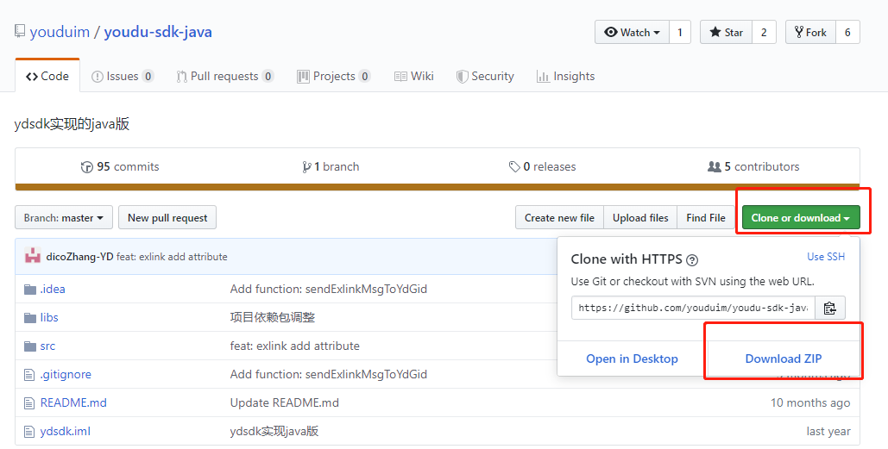
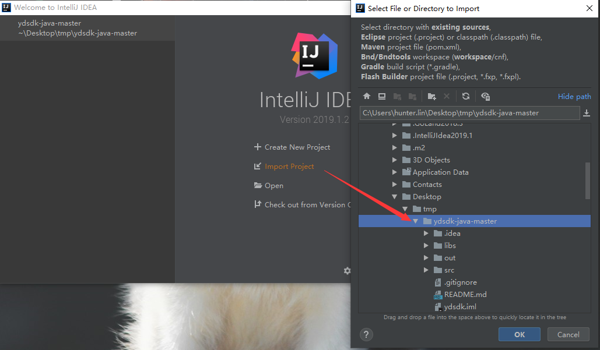
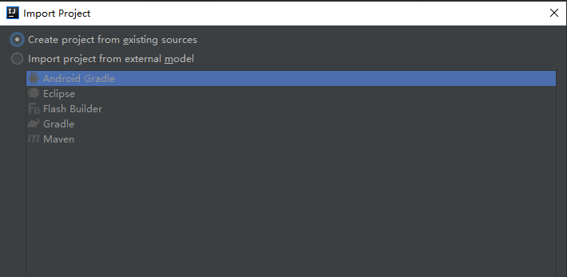
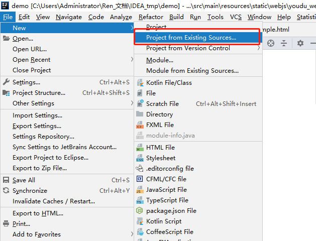
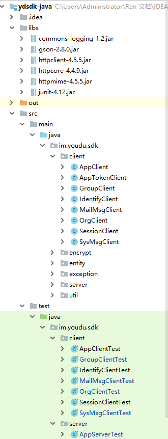

# 集成SDK

## Java环境

使用SDK需要依赖Java运行环境。

因Java默认只支持128位密钥的AES加解密，youdu sdk采用256位密钥，因此必须更新JCE无限制权限策略文件，否则运行将出现：java.security.InvalidKeyException:illegalKey Size 异常。

异常java.security.InvalidKeyException:illegal Key Size的解决方案 ：

1. 在官方网站下载JCE无限制权限策略文件

   JDK6的下载地址：
   [http://www.oracle.com/technetwork/java/javase/downloads/jce-6-download-429243.html](http://www.oracle.com/technetwork/java/javase/downloads/jce-6-download-429243.html)
   
   JDK7的下载地址：
   [http://www.oracle.com/technetwork/java/javase/downloads/jce-7-download-432124.html](http://www.oracle.com/technetwork/java/javase/downloads/jce-7-download-432124.html)
   
   JDK8的下载地址：
   [http://www.oracle.com/technetwork/java/javase/downloads/jce8-download-2133166.html](http://www.oracle.com/technetwork/java/javase/downloads/jce8-download-2133166.html)

2. 下载后解压，可以看到local_policy.jar和US_export_policy.jar以及readme.txt
3. 如果安装了JRE，将两个jar文件放到%JRE_HOME%\lib\security目录下覆盖原来的文件
4. 如果安装了JDK，将两个jar文件放到%JDK_HOME%\jre\lib\security目录下覆盖原来文件

## 源码下载

### 下载方式1

访问github：[ydsdk-java](https://github.com/youduim/ydsdk-java)

下载源码：

### 下载方式2

使用git工具下载，下载地址为：[https://github.com/youduim/youdu-sdk-java.git](https://github.com/youduim/youdu-sdk-java.git)

## 源码调试

本文使用 IntelliJ IDEA开发工具。

导入下载的源码到开发工具里面：

选择创建一个新工程：

或者在已有项目中新增一个导入：

项目结构为：

