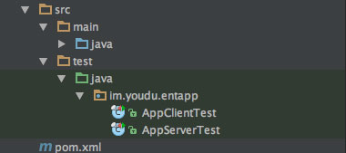
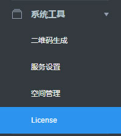
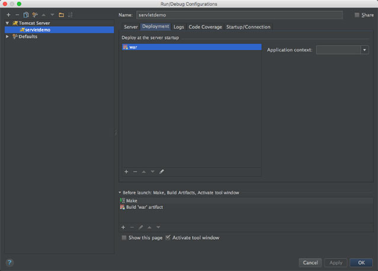

## 内容介绍

- 企业应用http接口调用封装（SDK）
- 企业应用http server回调接口通用java示例
- 企业应用http server回调接口JAVAEE servlet示例
- 企业应用接口调用测试用例
- 企业应用回调接口测试用例

## 依赖库

- Google Gson 2.8.0
- javatuples 1.2
- Apache httpclient 4.5.2
- Apache httpmine 4.5.2
- JAVAEE javaee-api或javaee-web-api 6.0 (可选)
- junit 4.2 (测试用)

## 开发工具

- IntelliJ IDEA 15 或更高版本
- Apache Maven
- jdk1.6 或更高版本
- Tomcat(可选)

## 注意事项

加解密过程可能出现java.security.InvalidKeyException:illegal Key Size的异常，是由于jre的权限限制引起，需要以下方法解决。 

说明：异常java.security.InvalidKeyException:illegal Key Size的解决方案 

在官方网站下载JCE无限制权限策略文件

```
JDK6的下载地址：
http://www.oracle.com/technetwork/java/javase/downloads/jce-6-download-429243.html
JDK7的下载地址：
http://www.oracle.com/technetwork/java/javase/downloads/jce-7-download-432124.html
JDK8的下载地址：
http://www.oracle.com/technetwork/java/javase/downloads/jce8-download-2133166.html
```

下载后解压，可以看到local_policy.jar和US_export_policy.jar以及readme.txt

如果安装了JRE，将两个jar文件放到%JRE_HOME%\lib\security目录下覆盖原来的文件

如果安装了JDK，将两个jar文件放到%JDK_HOME%\jre\lib\security目录下覆盖原来文件

## 集成方法

### 使用maven

对于使用maven管理的项目，可以将ydsdk加入到您项目的pom依赖中，内容如下：

```
<dependencies>
    <dependency>
        <groupId>im.youdu.ydsdk</groupId>
        <artifactId>ydsdk</artifactId>
        <version>1.0</version>
    </dependency>
</dependencies>
```

并将该项目导入您的工作空间。以`IntelliJ IDEA`为例，在右侧`Maven Projects`标签页里点击加号把`ydsdk`的pom.xml添加到maven项目中。

 


### 手动集成

首先请检查您项目中是否包含以下依赖库（版本仅供参考），如果没有请自行下载添加：

- Google Gson 2.8.0
- javatuples 1.2
- Apache httpclient 4.5.2
- Apache httpmine 4.5.2

直接将`ydsdk`项目的`src/main/java`目录下的`im.youdu.entapp`包复制到您的项目源码中即可。

### 运行测试用例

使用`IntelliJ IDEA`打开`ydsdk`项目，等待依赖库下载完毕后，在`ydsdk`项目中`src/test/java`目录下的`im.youdu.entapp`包下可以找到以`Test.java`结尾的测试用例。



目前有两个测试用例：

- AppClientTest 用来测试发送消息、上传下载文件等主动调用接口。
  运行前需要编辑文件内的相关参数
  
  

- Address是有度服务器的目标地址(ip:port)。 

- Buin是有度服务器license的企业号码，位于有度后台管理器的license菜单中。
  
  

- EncodingaesKey在有度后台管理器中企业应用的基本信息可以找到如下图：
  
  

- AppId对应上图中的企业应用App ID。

- ToUsers是测试收取消息的测试帐号，可以填写多个用`|`符号分割，测试前请先登录以激活该帐号。

- AppServerTest 用来测试接收消息等回调接口。 运行前需要编辑文件内的相关参数

  

  Buin、AppId同上。

  AESKey在企业应用回调接口设置页面可以找到。

  

  Token同上。
  Port是您本地即将运行的测试服务监听的端口号。
  Uri是您本地即将运行的测试服务器提供的回调接口。 可将您本地的IP地址、端口号、Uri组成一个回调URL填写在管理后台应用设置的回调接口设置页面上。

填写好参数后，可以右键点击文件选择Run'xxx'来运行测试。


### 示例介绍

本sdk提供了两个示例，一个是标准java程序示例，另一个是JavaEE servlet示例。
示例展示了最简单的企业应用实现，只包含接收消息部分。

#### normaldemo 标准java程序示例

使用`IntelliJ IDEA`打开`normaldemo`项目，编辑`src/main/java`中的`im.youdu.normaldemo`包内的`AppMsgHandler`类，填写必要的参数，端口默认是8080在`NormalAppExample`类中定义。


#### servletdemo JavaEE程序示例

请先安装tomcat，并在`IntelliJ IDEA`中配置好tomcat的Run/Debug设置。


注意设置好Application Server为您安装的Tomcat的目录。


使用 `IntelliJ IDEA` 打开`servletdemo`项目，在tomcat的Run /Debug设置中把servletdemo的名为`war`的Artifacts加入到Deployment中。



编辑`src/main/java`中的`im.youdu.servletdemo`包内的`AppMsgHandler`类，填写必要的参数，端口号在tomcat的Run/Debug设置中，默认一般是8080。

在IDEA中运行tomcat服务。

