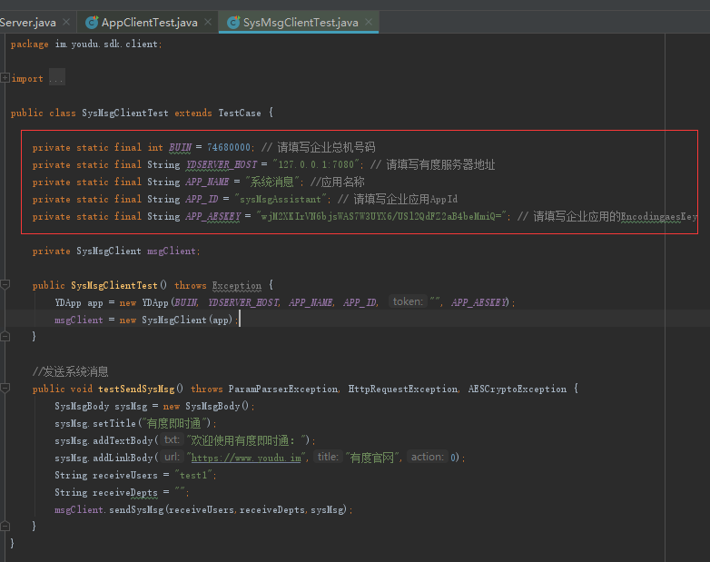

# 调用SDK发送系统消息

## 获取应用参数

BUIN：有度管理后台->我的企业->企业信息->公司总机号码。

YDSERVER_HOST：有度服务器地址，默认端口为7080（通常不用改）。

 APP_ID：sysMsgAssistant；

APP_AESKEY：有度管理后台->管理工具->系统消息->EncodingAESKey。

## 发送系统消息

使用SysMsgClientTest单元测试用例

修改全局参数配置

调用testSendSysMsg方法发起请求

## 常见异常

**1、** **运行时提示：java.security.InvalidKeyException:illegal Key Size**

通常机器安装了多个JDK，两个jar包（local_policy.jar、US_export_policy.jar）替换到其他JDK目录上。

可以用代码获取当前项目使用的jdk目录：System.out.println(System.getProperty("java.home")); 

**2、** **运行时提示：im.youdu.sdk.exception.HttpRequestException: invalid buin** 

通常是总机号码填写错误，常见于测试服务器的总机号码跟正式服务器不一样，请在 “有度管理后台->我的企业->企业信息->公司总机号码”查看正确总机号码。

**3、** **运行时提示：im.youdu.sdk.exception.HttpRequestException: invalid appId** 

通常是appId错误，或调用接口的应用类型不匹配，比如不能使用系统消息应用调用同步组织架构接口。

**4、** **运行时提示：java.lang.IllegalArgumentException: Missing argument**

通常是EncodingAESKey填写错误，或后面的‘=’号没有拷贝进去。