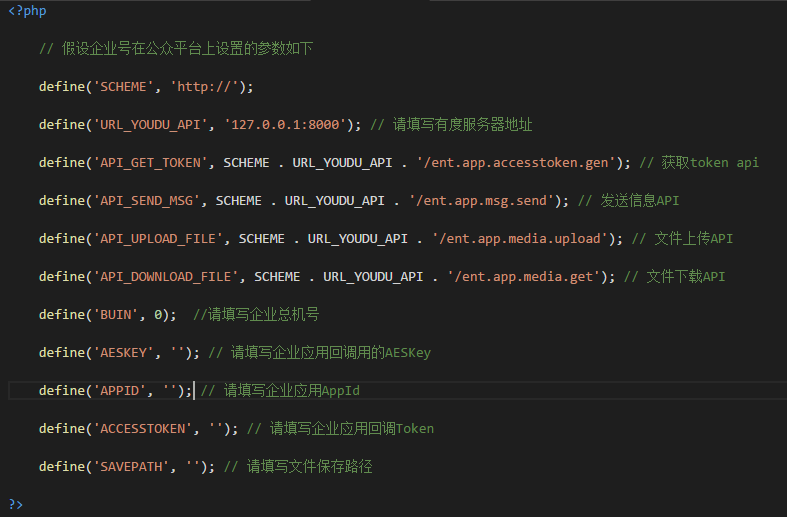
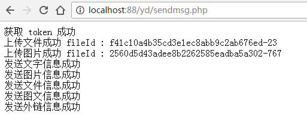
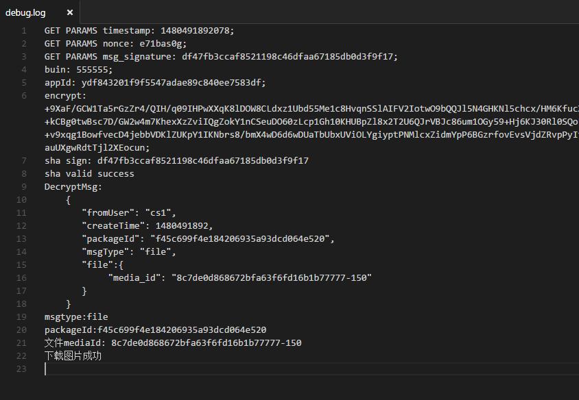

## 内容介绍

- 企业应用http接口调用封装（SDK）
- 企业应用接口调用测试用例
- 企业应用回调接口测试用例

## 依赖模块

- cURL
- Mcrypt

## 运行前配置

## 运行

### 发送消息

运行 sdk 目录下的 sendmsg.php 文件，若能成功，则会如下图显示。

### 回调设置

运行 sdk 目录下的 receivemsg.php 文件，运行结果会在同级目录下 debug.log 中显示，例子如下：

