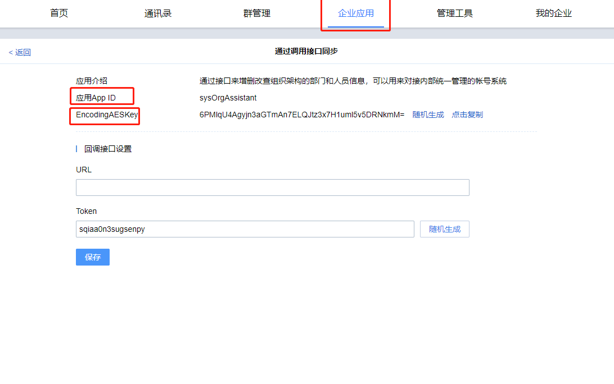

基于JAVA语言SDK进行编写，其他语言版本SDK可参考集成的案例场景。

这里提供了客户最为需要的案例集成，每个案例都是单独的功能模块，您可以根据需要阅读。

所有的案例均基于服务器API，如果您想有更个性的需求，可以参考[服务器API](c01_00001.md)。

## 下载SDK

通过github源码下载，下载地址为：https://github.com/youduim/ydsdk-java

下载后可以将源码导出jar包引入项目或直接引入源码到项目

> 源码引入需要拷贝到路径顶层，即不要放到包里面

## 注意事项

加解密过程可能出现java.security.InvalidKeyException:illegal Key Size的异常，是由于jre的权限限制引起，需要以下方法解决。 

说明：异常java.security.InvalidKeyException:illegal Key Size的解决方案 在官方网站下载JCE无限制权限策略文件

```
JDK6的下载地址：
http://www.oracle.com/technetwork/java/javase/downloads/jce-6-download-429243.html
JDK7的下载地址：
http://www.oracle.com/technetwork/java/javase/downloads/jce-7-download-432124.html
JDK8的下载地址：
http://www.oracle.com/technetwork/java/javase/downloads/jce8-download-2133166.html
```

下载后解压，可以看到local_policy.jar和US_export_policy.jar以及readme.txt

如果安装了JRE，将两个jar文件放到%JRE_HOME%\lib\security目录下覆盖原来的文件

如果安装了JDK，将两个jar文件放到%JDK_HOME%\jre\lib\security目录下覆盖原来文件

## 通用参数说明

参数需要通过有度服务器管理后台企业应用中获取

| 参数名称     | 类型   | 描述                                        |
| ------------ | ------ | ------------------------------------------- |
| buin         | int    | 企业总机号码                                |
| ydServerHost | String | 有度服务器地址及端口                        |
| appId        | String | 应用Id，无特殊说明使用组织架构同步应用appId |
| appAesKey    | String | 应用Id对应的EncodingaesKey                  |

buin参数获取：


应用参数获取：

