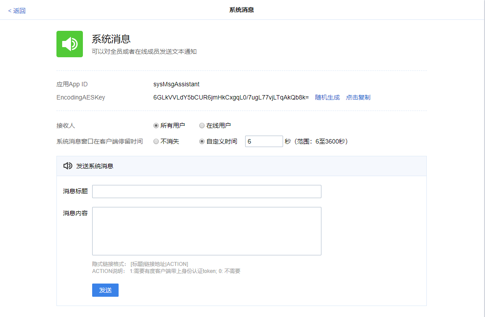

> 通过此集成可以向指定用户或指定部门发送系统消息。
## 获取应用参数

在发送系统消息之前，您需要通过有度管理后台->管理工具->系统消息获取应用APP ID,EncodingAESKey值。




## 初始化客户端

```java
int buin = 14731009;// 请填写企业总机号码
String ydServerHost = "127.0.0.1:7080";// 请填写有度服务器地址
String appName="系统消息";
String appId = "sysMsgAssistant";// 请填写企业应用AppId
String appAesKey = "6PMlqU4Agyjn3aGTmAn7ELQJtz3x7H1uml5v5DRNkmM=";// 请填写企业应用的EncodingaesKey
YDApp app = new YDApp(buin, ydServerHost, appName, appId, "", appAesKey);
SysMsgClient msgClient = new SysMsgClient(app);
```

## 发送系统消息

发送系统消息给用户或部门

#### 方法原型

```java
public void sendSysMsg(String toUser, String toDept, SysMsgBody sysMsg) throws ParamParserException, HttpRequestException, AESCryptoException;
```

#### 参数说明

| 参数名称     | 类型       | 描述                                      |
| ----------| ----------| ---------------------------------------------|
| toUser   | String     | 用户名称，通过\|分隔（示例："youdu1\|youdu2"。如果不是发给用户，可传输"") |
| toDept   | String     | 部门Id，通过\|分割(示例："100\|101"。如果不是发送给部门，可传输"") |
| sysMsg   | SysMsgBody | 发送的消息体                                |

#### sysMsg成员说明

| Request成员 | 设置方法 | 描述                                                |
| ----------- | -------- | --------------------------------------------------- |
| title       | Set方法  | 标题                                                |
| textBody    | Add方法  | 消息体                                              |
| linkBody    | Add方法  | 超链接                                              |
| popDuration | Set方法  | 弹窗显示时间，0及负数弹窗不消失，正数为对应显示秒数 |

#### 返回结果说明

成功：没有返回值。

失败：发生错误（如请求失败），抛出异常。

#### 请求示例

```java
SysMsgBody sysMsg = new SysMsgBody();
sysMsg.setTitle("有度即时通");
sysMsg.addTextBody("欢迎使用有度即时通：");
sysMsg.addLinkBody("https://www.youdu.im","有度官网",0);
sysMsg.setPopDuration(5);
String receiveUsers = "youdu0";
String receiveDepts = "1|2|3";
msgClient.sendSysMsg(receiveUsers,null,sysMsg);
```