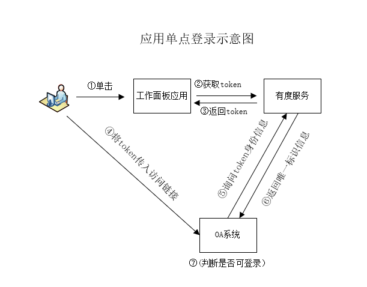

在有度即时通客户端企业应用面板，通过点击应用图标实现单点登录至第三方系统。需要第三方系统集成有度的加密token，从而实现无需用户再次输入用户名密码即可进入到业务系统。

## 流程说明

单点登录集成示例：[https://github.com/youduim/youdu-sso-demo-java](https://github.com/youduim/youdu-sso-demo-java)

有度单点登录到第三方系统流程示意图：



主要步骤：

①    用户点击带有$TOKEN$模版参数的链接。

②    客户端向服务器获取token。

③    服务器返回token。

④    客户端将token替换模版参数$TOKEN$，并打开浏览器访问此链接。

⑤    OA服务器收到请求，取出token，将token发到有度服务器验证。

⑥    有度服务器验证成功，返回用户身份信息。

⑦    OA服务器允许用户登录。

## 使用SDK验证Token

在有度管理后台-->企业应用-->应用管理-->主页型应用配置的URL中使用模板参数$TOKEN$，有度客户端在请求时会自动将该模板参数替换成identifytoken。

如过还没准备好接收URL请求的Web服务器，可以将浏览器地址栏identifytoken值复制出来先进行单元测试。

> token仅三分钟有效，失效后需要重新获取。

#### 初始化客户端

```java
String ydServerHost = "127.0.0.1:7080";
IdentifyClient identifyClient = new IdentifyClient(YDSERVER_HOST);
```

#### 功能说明

使用SDK验证identifytoken是否有效

#### 方法原型

```java
public UserInfo idetify(String ydToken) throws HttpRequestException, ParamParserException, ServiceException;
```

#### 参数说明

| 参数名称 | 描述              | 类型   |
| -------- | ----------------- | ------ |
| ydToken  | identifytoken凭证 | String |

#### 返回结果说明

成功：返回UserInfo实体

失败：发生错误（如请求失败），抛出异常。

#### 请求示例

```java
UserInfo userInfo = identifyClient.idetify(YD_IDENTIFY_TOKEN);
System.out.println(userInfo);
```

## 使用API验证

参见[单点登录API](c01_00007.md)

## 特殊情况

#### 场景1

Web服务器代码无法修改，但提供了登录进入系统的接口，针对此场景，可以写一个中间插件，插件负责验证token，然后调用Web服务器接口登录系统。

提供给有度客户端的链接地址是插件的url，参数带上将要跳转的目标url，如：http://plugin_ip:8080/token=$TOKEN$&redirect=http://oa_ip:8080

#### 场景2

Web服务器代码无法修改，并且没有提供登录系统的接口，针对此场景，可以写一个中间插件，用户首次访问，插件提供页面让用户填写访问Web系统的帐号和密码，插件将帐号密码保存起来（建议加密保存）。

下次访问时：

①    准备好一个页面（如：jump.html），此页面在onload事件自动提交表单给目标Web服务器。jump.html的表单从正式登录页面拷贝过来，用户名和密码做成模版参数$UserName$、$Pwd$，待插件替换。

②    插件收到跳转登录请求时先验证token，获取用户名。

③    通过用户名获取之前保存的密码，将用户名和密码替换jump.html表单模版参数，将此html返回给浏览器。

④    浏览器收到jump.html后onload事件自动提交带有用户名和密码的表单给Web服务器，实现登录。