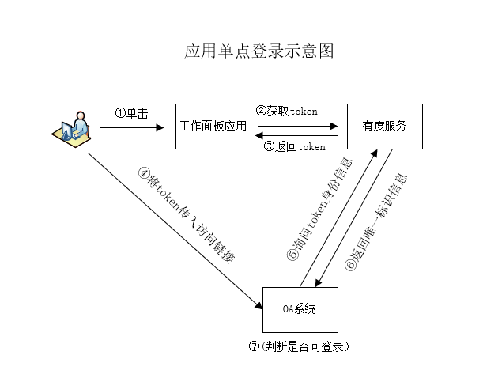

# 流程说明

单点登录集成示例：https://github.com/youduim/youdu-sso-demo-java

有度单点登录到第三方系统流程示意图：

主要步骤：

①    用户点击带有$TOKEN$模版参数的链接。

②    客户端向服务器获取token。

③    服务器返回token。

④    客户端将token替换模版参数$TOKEN$，并打开浏览器访问此链接。

⑤    OA服务器收到请求，取出token，将token发到有度服务器验证。

⑥    有度服务器验证成功，返回用户身份信息。

⑦    OA服务器允许用户登录。

