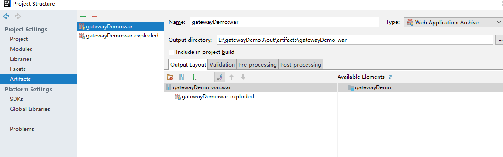

有度服务器开放了短信接口，可以通过二次开发，将有度短信接入企业内部自己的短信通道，从而支持有度客户端发送短信。

目前广州首易（专业短信提供商）已经开发了现成的有度短信插件，安装后向首易公司购买短信即可使用，无需二次开发，如需了解请咨询有度官方客服：400-097-0006。

文本介绍自行二次开发短信网关。

## 短信网关调试说明

### 导入工程

1) 下载有度短信网关Demo

https://github.com/youduim/sms-demo-java

2) 导入pom.xml

3) 设置resource目录为资源文件夹

4) 配置Artifacts

a)删除原来所有的war包。

b) 添加新Artifacts，点击“+”-> Web Application exploder -> from modules -> 确定，此时会出现下图，点击ok即可。

### 配置Tomcat

1) 点击这里进入配置tomcat。

2) 点击“+”-> Tomcat Server -> local，一开始会提醒缺少artifacts。

3) 添加artifacts，选择后缀为exploded的artifacts->Apply->OK。

（图5 选择war包）

### 配置应用参数

（图6 配置应用参数）

BUIN：有度管理后台->我的企业->企业信息->公司总机号码。

YDSERVER_HOST：有度服务器地址，默认端口为7080（通常不用改）。

APP_ID和APP_AESKEY：有度管理后台->管理工具->短信网关。

### 配置回调URL

（图7 配置回调URL）

### 设置短信权限

### 客户端测试

## 集成开发

1) 在上图“1”位置将短信发到短信平台。

2) 手机上行短信给有度，按上图“2”方式把短信给有度客户端。