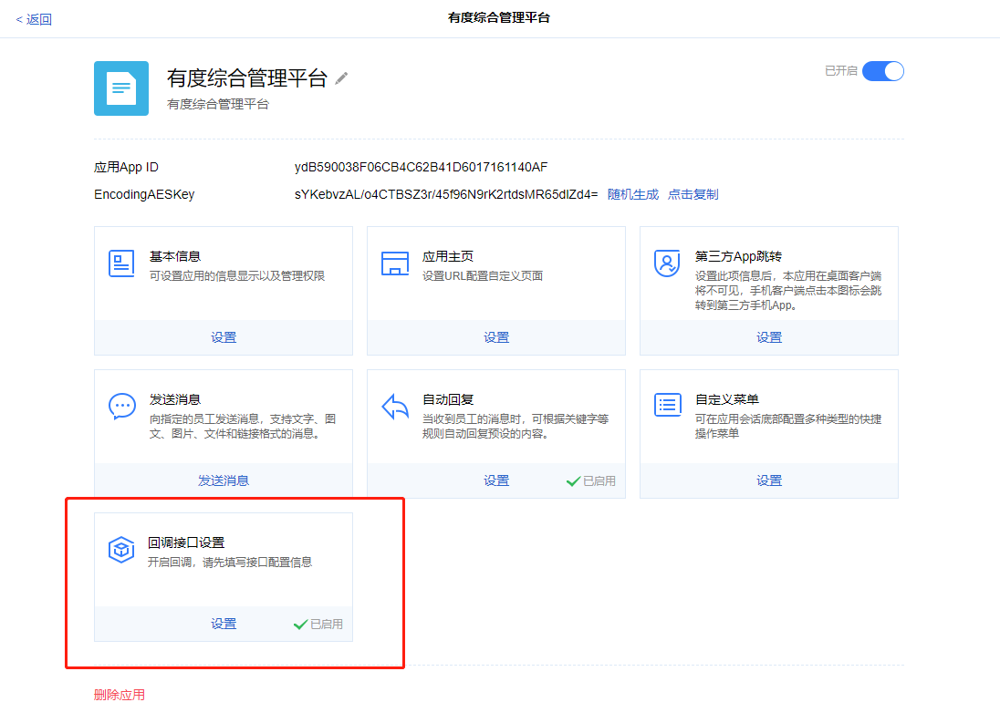
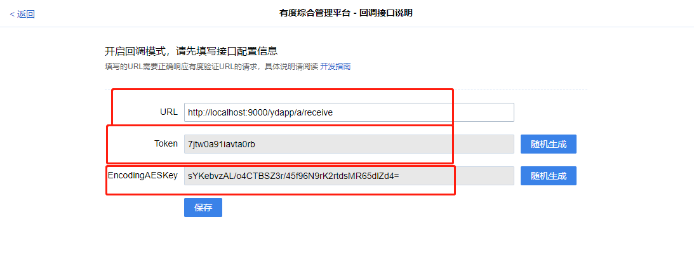

应用机器人是根据用户在应用里发送消息，经过关键字来判断是否要回复信息。

有度支持通过后台配置简单的自动回复，如果企业需要更个性的需求，例如查询开发票信息，获取企业内部系统数据。有度同时提供了供企业二次开发的接口。

## 使用管理后台设置指南

通过有度管理后台设置自动回复，仅支持回复文字消息。有精确匹配以及模糊匹配两种模式可供选择。

**开启自动回复**

有度管理后台->企业应用->自建应用（企业自己创建的应用）->开启自动回复。


**设置关键字回复**

通过新建规则进行关键字回复创建


集成机器人自动回复需要实现接收应用消息回调，发送应用消息。

企业可自行设计机器人回复规则。

有度服务器通过http方试回调，因此接收消息回调需要是一个Web服务。

## 初始化客户端

```java
int buin = 36363636; // 请填写企业总机号码
String ydServerHost = "127.0.0.1:7080"; // 请填写有度服务器地址
String appName = "A应用"; //应用名称
String appId = "yd1696C4567A0B4B3C9EA54BA935BEF986"; // 请填写企业应用AppId
String appAesKey = "9NdlYC88tf0rQ66a3Q+6+QYqp31OxkJeqsDtXyViKk8="; // 请填写企业应用的EncodingaesKey
YDApp app = new YDApp(buin, ydServerHost, appName, appId, "", appAesKey);
AppClient appClient = new AppClient(app);
```

## 应用消息回调

如果仅测试功能，可以使用YDSDK中AppServerTest测试用例进行测试。

### 应用参数获取

进入到需要设置的企业自建应用-设置回调接口

获取应用APPID



设置应用回调

设置一个有度服务器可以访问到的URL地址（消息会推送到这个接口）。

获取应用Token，获取AESKey



### 集成示例

**功能说明**

接收应用消息回调

**方法1-接收消息回调（依赖方法2）**

```java
@RequestMapping("/ydapp/a/receive")
@ResponseBody
public String receive(HttpServletRequest request) throws IOException {
    int buin = 14731009; // 请填写企业总机号码
    String appName = "有度综合管理平台"; //请填写应用名称
    String appId = "ydB590038F06CB4C62B41D6017161140AF"; // 请填写应用AppId
    String appToken = "7jtw0a91iavta0rb"; //请填写应用回调token
    String appAesKey = "sYKebvzAL/o4CTBSZ3r/45f96N9rK2rtdsMR65dlZd4="; // 请填写应用回调EncodingAesKey

    YDApp ydApp = new YDApp(buin, "", appName, appId, appToken, appAesKey);

    //请求参数
    Map<String, String> map = new HashMap<>(3);
    Enumeration<String> keys = request.getParameterNames();
    while (keys.hasMoreElements()) {
        String key = keys.nextElement();
        map.put(key, request.getParameter(key));
    }

    //请求数据体
    InputStream in = request.getInputStream();
    byte[] reqData = Helper.readInputStream(in);

    AppClient appClient = new AppClient(ydApp);
    try {
        //处理接收到的数据体
        handleReceive(map, reqData, appClient, ydApp);
    } catch (GeneralEntAppException e) {
        e.printStackTrace();
    }
    //返回接收成功，不返回接收成功会重复收到消息推送
    return "ok";
}
```

**方法2-处理加密消息（依赖方法3）**

```java
/**
 * 解密消息体
 * @param reqParam  请求参数
 * @param reqData 请求数据体
 * @param appClient 客户端
 * @param app 客户端实体
 * @throws GeneralEntAppException 异常
 * @throws IOException 异常
 */
private void handleReceive(Map<String, String> reqParam, byte[] reqData, AppClient appClient, YDApp app) throws GeneralEntAppException, IOException {
    String content = Helper.utf8String(reqData);
    JsonObject reqJson = Helper.parseJson(content);
    int buin = Helper.getInt("toBuin", reqJson);
    String appId = Helper.getString("toApp", reqJson);
    String encrypt = Helper.getString("encrypt", reqJson);
    if (buin != app.getBuin()) {
        System.out.println(String.format("[%s][error] from buin %d is unequal local buin %d", app.getAppName(), buin, app.getBuin()));
        return;
    }

    if (!appId.equals(app.getAppId())) {
        System.out.println(String.format("[%s][error] from appId %s is unequal local appId %s", app.getAppName(), appId, app.getAppId()));
        return;
    }

    boolean fromYD = Helper.signatureIsValid(reqParam, app.getToken(), encrypt);
    if (!fromYD) {
        System.out.println(String.format("[%s][error] signature is invalid", app.getAppName()));
        return;
    }
    ReceiveMessage msg = appClient.decrypt(encrypt);
    receive(msg);
}
```

**方法3-处理解密后的明文消息**

```java
/**
 * 接收到的明文消息
 * @param message 消息类
 */
private void receive(ReceiveMessage message) {
    try {
        String msgType = message.getMsgType();
        switch (msgType) {
            case Const.Message_App_Type_Event: {
                EventBody event = message.getAsEvent();
                System.out.println(String.format("receive app event, appId:%s, operation:%s ", event.getId(), event.getOperation()));
                break;
            }
            case Const.Message_App_Type_Sms: {
                SmsBody smsMsg = message.getAsSmsMsg();
                System.out.println(String.format("receive app sms msg: %s", smsMsg.getContent()));
                break;
            }
            case Const.Message_Session_Type_Text: {
                String text = message.getAsTextMsg();
                System.out.println(String.format("receive text msg: %s", text));
                break;
            }
            case Const.Message_Session_Type_File: {
                FileBody appFile = message.getAsFileMsg();
                System.out.println(String.format("receive file msg, mediaId:: %s, you can download it by AppClient::downloadFileAndSave", appFile.getMediaId()));
                break;
            }
            case Const.Message_Session_Type_Image: {
                ImageBody appImg = message.getAsImageMsg();
                System.out.println(String.format("receive img msg mediaId: %s, you can download it by AppClient::downloadImageAndSave", appImg.getMediaId()));
                break;
            }
            case Const.Message_Session_Create: {
                SessionCreateBody sessionCreate = message.getAsSessionCreate();
                System.out.println(String.format("receive session create event: %s", sessionCreate.toJsonString()));
                break;
            }
            case Const.Message_Session_Update: {
                SessionUpdateBody sessionUpdate = message.getAsSessionUpdate();
                System.out.println(String.format("receive sesion update event: %s", sessionUpdate.toJsonString()));
                break;
            }
            case Const.Message_Session_Type_Audio: {
                AudioBody audio = message.getAsAudioMsg();
                System.out.println(String.format("receive audio msg, mediaId:%s", audio.getMediaId()));
                break;
            }
            case Const.Message_Session_Type_Complex: {
                ComplexBody complexBody = message.getAsComplexMsg();
                System.out.println(String.format("receive complex msg: %s", complexBody.getBody()));
                break;
            }
            case Const.Message_Session_Type_System: {
                RecvSystemMsgBody systemMsgBody = message.getAsSystemMsg();
                System.out.println(String.format("receive system msg: %s", systemMsgBody.getMsg()));
                break;
            }
            case Const.Message_Session_Type_Broadcast: {
                RecvBroadcastBody broadcastBody = message.getAsBroadcastMsg();
                System.out.println(String.format("receive broadcast msg: %s", broadcastBody.getMsg()));
                break;
            }
            default: {
                break;
            }
        }
    } catch (Exception e) {
        e.printStackTrace();
    }
}
```

## 发送应用消息

### 发送文本消息

**功能说明**

向指定用户或指定部门发送文本消息。

**方法原型**

```java
public void sendTextMsg(String toUser, String toDept, String content) throws ParamParserException, AESCryptoException, HttpRequestException;
```

**参数说明**

| 参数名称 | 类型   | 描述                                                         |
| -------- | ------ | ------------------------------------------------------------ |
| toUser   | String | 接收成员的用户名列表。多个接收者用竖线\|分隔，最多支持1000个 |
| toDept   | String | 接收部门id列表。多个接收者用竖线\|分隔，最多支持100个        |
| content  | String | 消息内容，支持表情，最长不超过600个字符，超出部分将自动截取  |

**返回结果说明**

成功：没有返回。

失败：发生错误（如请求失败），抛出异常。

**请求示例**

```java
String receiveUsers = "test1|test2";
String receiveDepts = "1|2|3";
String text = "Hello, YD!!";
appClient.sendTextMsg(receiveUsers, receiveDepts, text);
```

### 发送图片消息

**功能说明**

向指定用户或指定部门发送图片消息

**方法原型**

```java
public void sendImageMsg(String toUser, String toDept, String imageName, String imagePath) throws HttpRequestException, FileIOException, AESCryptoException, ParamParserException;
```

**参数说明**

| 参数名称  | 类型   | 描述                                                         |
| --------- | ------ | ------------------------------------------------------------ |
| toUser    | String | 接收成员的用户名列表。多个接收者用竖线\|分隔，最多支持1000个 |
| toDept    | String | 接收部门id列表。多个接收者用竖线\|分隔，最多支持100个        |
| imageName | String | 文件名称                                                     |
| imagePath | String | 文件地址                                                     |

**返回结果说明**

成功：没有返回。

失败：发生错误（如请求失败），抛出异常。

**请求示例**

```java
String receiveUsers = "test1|test2";
String receiveDepts = "1|2|3";
String imgName = "2018-01-01.jp";
String imgPath = "D:\\pics\\2018\\2018-01-01.jpg";
appClient.sendImageMsg(receiveUsers, receiveDepts, imgName, imgPath);
```

