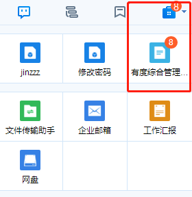

# 待办角标

此案例依赖于自建应用、Youdu SDK。在开始之前，请阅读[快速入门](./a01_00001.md)

## 结果展示



## 初始化客户端

```java
int buin = 36363636; // 请填写企业总机号码
String ydServerHost = "127.0.0.1:7080"; // 请填写有度服务器地址
String appName = "A应用"; //应用名称
String appId = "yd1696C4567A0B4B3C9EA54BA935BEF986"; // 请填写企业应用AppId
String appAesKey = "9NdlYC88tf0rQ66a3Q+6+QYqp31OxkJeqsDtXyViKk8="; // 请填写企业应用的EncodingaesKey
YDApp app = new YDApp(buin, ydServerHost, appName, appId, "", appAesKey);
AppClient appClient = new AppClient(app);
```

## 设置角标

**功能说明**

向指定用户设置应用待办角标。

**方法原型**

```java
public void setAppNotice(String account, int msgCount, String tip) throws ParamParserException, AESCryptoException, HttpRequestException;
```

**参数说明**

| 参数名称 | 类型   | 描述                                          |
| -------- | ------ | --------------------------------------------- |
| account  | String | 用户名                                        |
| msgCount | int    | 代办数，为0时表示清楚角标，右下角不弹出通知框 |
| tip      | String | 提示消息                                      |

**返回结果说明**

成功：没有返回

失败：发生错误（如请求失败），抛出异常。

**请求示例**

```java
String account = "youdu0";
String tip = "test";//提示消息
int count = 8;
appClient.setAppNotice(account, count, tip);
```