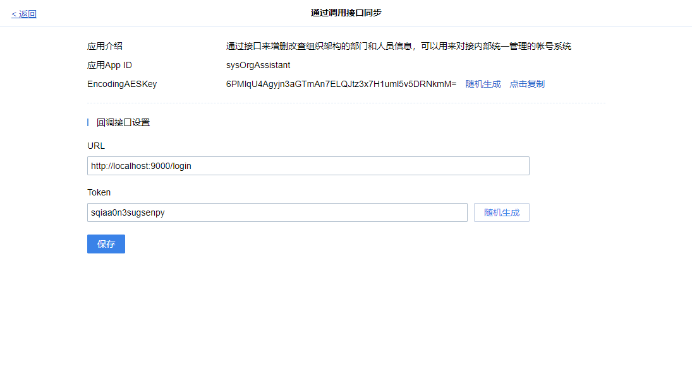

第三方认证指登录有度客户端时，将登录请求验证转发至第三方平台进行认证。

第三方认证触发条件为，将用户设置为第三方认证。设置请参考设置认证信息。


下载有度短信网关Demo：

https://github.com/youduim/auth-demo-java

## 设置认证回调地址

在有度管理后台->企业应用->组织架构同步->通过调用接口同步->回调接口设置URL



## 设置认证信息

**功能说明**

调用有度SDK，设置用户认证方式为第三方认证

**方法原型**

```java
public void setUserLoginAuthType(String userId, int authType) throws ParamParserException, AESCryptoException, HttpRequestException;
```

**参数说明**

| 参数名称 | 类型   | 描述                             |
| -------- | ------ | -------------------------------- |
| userId   | String | 用户名                           |
| authType | int    | 认证方式：0本地认证，2第三方认证 |

**返回结果说明**

成功：没有返回

失败：发生错误（如请求失败），抛出异常。

**请求示例**

```java
orgClient.setUserLoginAuthType("test1", Const.AuthType_Other); //设置为第三方认证方式
System.out.println("set user auth ok");
```

## 认证回调

**功能说明**

用户认证方式为第三方认证时，登录请求会回调至设置的认证回调地址中。此功能为第三方系统接受有度服务发起的回调并验证用户的合法性以实现用户登录操作。

有度根据响应值判断是否登录成功。

此集成不依赖于有度SDK。

**回调数据**

```json
{
    "fromUser": "fakeacc",
    "createTime": 1348831860,
    "packageId":  1234567890,
    "msgType": "auth",
    "passwd": ${passwd}
}
```

**参数说明**

| 参数名称   | 类型   | 描述                         |
| ---------- | ------ | ---------------------------- |
| fromUser   | String | 请求认证的用户               |
| createTime | long   | 时间戳                       |
| packageId  | String | 请求ID                       |
| msgType    | String | 消息类型。回调认证固定为auth |
| passwd     | String | 用户的原始密码               |

**回调响应格式**

```java
//响应数据为JSON格式
JsonObject obj = new JsonObject();
obj.addProperty("errcode", 0);
obj.addProperty("errmsg", "");
obj.addProperty("encrypt", "");
return obj.toString();
```

**errcode参数值**

| 响应值 | 描述       |
| ------ | ---------- |
| 0      | 认证成功   |
| 300002 | 认证失败   |
| 300001 | 帐号不存在 |
| -1     | 内部错误   |