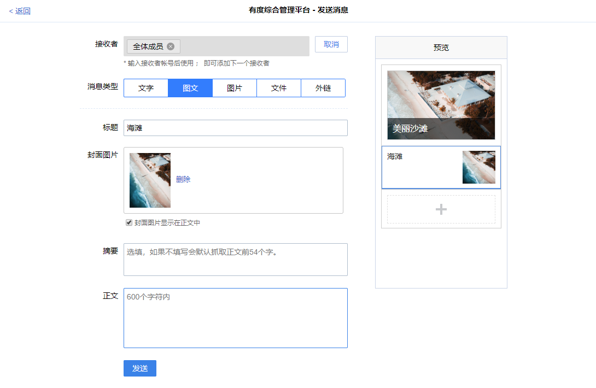

# 概述

自建应用允许发送发送文字、图文、图片、文件、外链消息。

支持直接在有度管理后台发送，也支持通过SDK发送。



自建应用也支持添加菜单。

在开始使用Youdu SDK之前，请先阅读[快速入门](./a01_00001.md)。

## 初始化客户端

```java
int buin = 36363636; // 请填写企业总机号码
String ydServerHost = "127.0.0.1:7080"; // 请填写有度服务器地址
String appName = "A应用"; //应用名称
String appId = "yd1696C4567A0B4B3C9EA54BA935BEF986"; // 请填写企业应用AppId
String appAesKey = "9NdlYC88tf0rQ66a3Q+6+QYqp31OxkJeqsDtXyViKk8="; // 请填写企业应用的EncodingaesKey
YDApp app = new YDApp(buin, ydServerHost, appName, appId, "", appAesKey);
AppClient appClient = new AppClient(app);
```