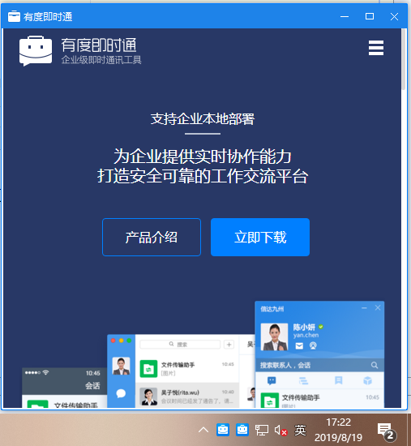

# 概述

有度PC客户端支持弹出内置浏览器，从而可以集成企业自有的网站。例如定时向员工推送企业内部新闻。

支持设置窗口宽度、高度、弹框停留时间等功能。

此案例依赖于自建企业应用、Youdu SDK。在开始之前，请阅读[快速入门](https://youdu.im/api/quickstart.html)

## 效果展示



## 初始化客户端

```java
int buin = 36363636; // 请填写企业总机号码
String ydServerHost = "127.0.0.1:7080"; // 请填写有度服务器地址
String appName = "A应用"; //应用名称
String appId = "yd1696C4567A0B4B3C9EA54BA935BEF986"; // 请填写企业应用AppId
String appAesKey = "9NdlYC88tf0rQ66a3Q+6+QYqp31OxkJeqsDtXyViKk8="; // 请填写企业应用的EncodingaesKey
YDApp app = new YDApp(buin, ydServerHost, appName, appId, "", appAesKey);
AppClient appClient = new AppClient(app);
```